Project 3 - Behavioral Cloning
==============================

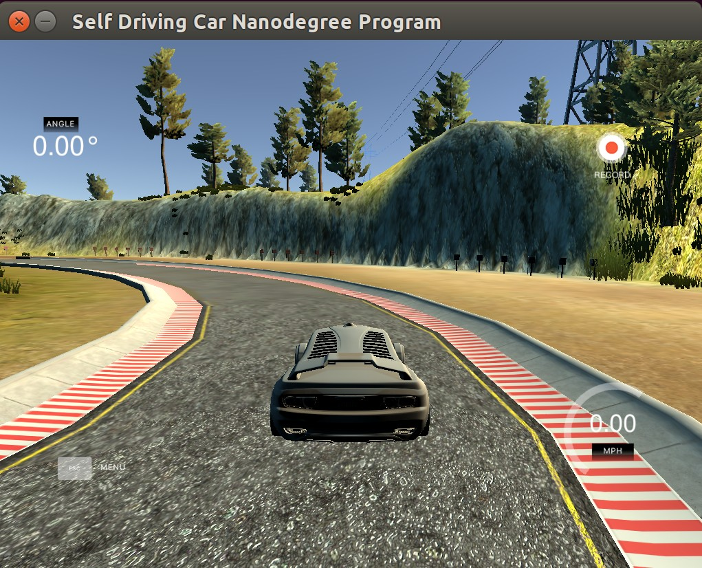

Abstract
--------

In this project, we apply Deep Learning to the task of end-to-end learning
for self-driving cars. In other words, the car learns from experience the
mapping from raw camera images to steering commands that keep the vehicle
on track.

We have followed the approach presented by
[Nvidia](http://images.nvidia.com/content/tegra/automotive/images/2016/solutions/pdf/end-to-end-dl-using-px.pdf), using a Convolutional Neural Network, since it's suitable
for image processing problems.

Data collection and testing have been performed in a simulator provided by
Udacity, consisting on 2 test tracks. Training has been performed using
data only from the first one. A challenge is to generalize this information
to the second track.

In the end, the trained model manages to successfully drive the car indefinitely
in Track 1. In Track 2, the car can follow the road curves fairly well, but it's
a bit slow to react to sharp curves, which in the end makes it crash into one
guardrail. Further tuning to make the car have a stronger response would allow
it to finish Track 2 as well.

Data Interfaces
----------------
The **input data** comes from a set of forward-looking cameras installed inside the
vehicle: one in the center, and two to the sides (left, right).

The simulator only uses the center camera during inference time
(predicting the steering angle in Autonomous mode). Nevertheless, we data from
all three cameras during training. The images from the cameras are RGB,
with resolution (160, 320)

In addition, we also have access to other vehicle signals, like throttle
and break commands, but are not relevant for the task of steering angle
prediction from images. We only use them to filter data where the vehicle
is not moving.

The **output data** is simply the steering angle in degrees. The log files have
normalized this value to a range between [-1, 1] to better suit the
Neural Network framework. This corresponds to roughly [-25º, 25º].


Model Architecture
------------------
We have implemented the convolutional neural network proposed by
[Nvidia](http://images.nvidia.com/content/tegra/automotive/images/2016/solutions/pdf/end-to-end-dl-using-px.pdf).
The following picture summarizes the model:

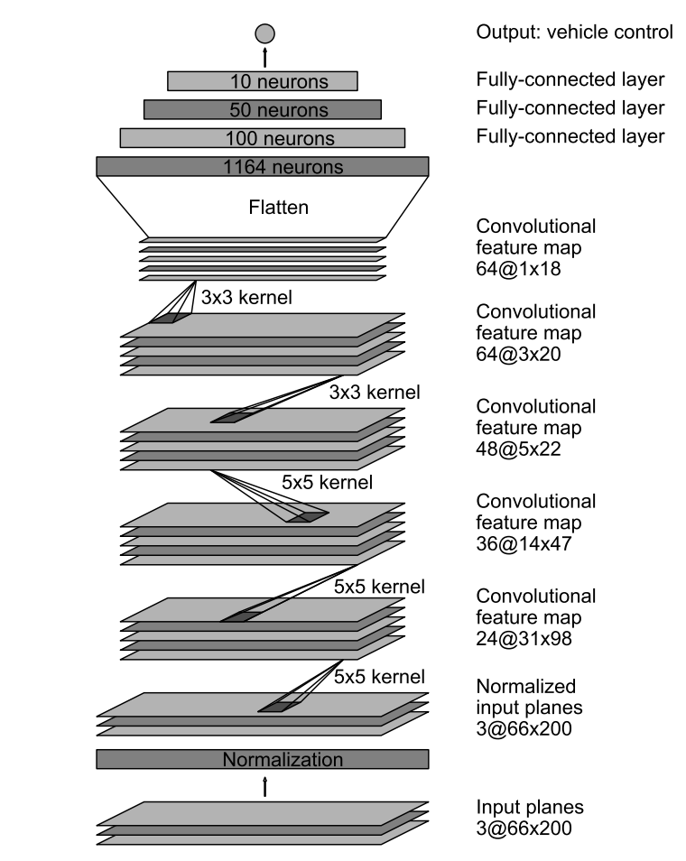

It is a relatively simple model (only 9 layers) with a moderate number of
parameters (around 250.000), so we can expect reasonable training times.
Clearly the desired approach is a combination of Convolutional layers
followed by Fully-Connected layers, since the input data is a raw RGB image.
This time, the architecture is applied to a **regression problem** (predicting
steering angle) instead of classification, so no activation function
or softmax must be applied at the last layer, which will have only one neuron.

The use of pre-trained networks like AlexNet or VGG (i.e. transfer learning)
was not considered from the beginning, since they were trained for different
purposes. Re-training these networks from scratch would take a much larger
effort, and we believe that to have a short loop between training and testing
is crucial. This was recommended also by many other students in the forums.

The implemented network consists of the following layers:

- **Input**. Image of size (66, 200, 3).
- **Normalization** to the range [-0.5, 0.5]. This is performed using a _Lambda_ in Keras.
- **Convolutional 1**. 24 filters of size 5x5x3 (since the input has 3 channels).
The filter is applied with strides of (2, 2) instead of using MaxPooling.
This can be done because the input image is relatively high resolution.
The used padding was 'valid', as proposed by Nvidia.

- **Convolutional 2**. 36 filters of size 5x5x24. Strides of (2, 2).
- **Convolutional 3**. 48 filters of size 5x5x36. Strides of (2, 2).
- **Convolutional 4**. 64 filters of size 3x3x48. Strides of (1, 1). As can be
observed, the filter size and strides are now reduced, given that the input
images are much smaller.
- **Convolutional 5**. 64 filters of size 3x3x64. Strides of (1, 1).

- **Flatten**. The input for the next layer will have size 1152.
- **Dropout** to mitigate the effects of overfitting.

- **Fully Connected 1**, with 100 neurons + Dropout.
- **Fully Connected 2**, with 50 neurons + Dropout.
- **Fully Connected 3**, with 10 neurons + Dropout.
- **Fully Connected 4**, with 1 neuron, being the output.

All the layers, except for the output layer, have a **ELU activation function**.
The motivation to prefer it over ReLU is that it has a continuous derivative
and x = 0 and does not kill negative activations. The result is a bit smoother
steering output.

We have used quite an agressive **Dropout with probability of keeping = 0.25**,
in order to prevent overfitting and have a smooth output.

In addition, all the layers are initialized with the 'glorot_uniform' function,
default in Keras.
The main improvement over Nvidia's implementation is to add the Dropout
layers in order to fight against overfitting.

In total the network has **252219 parameters**, including weights and biases.
Below is attached the model summary from Keras:

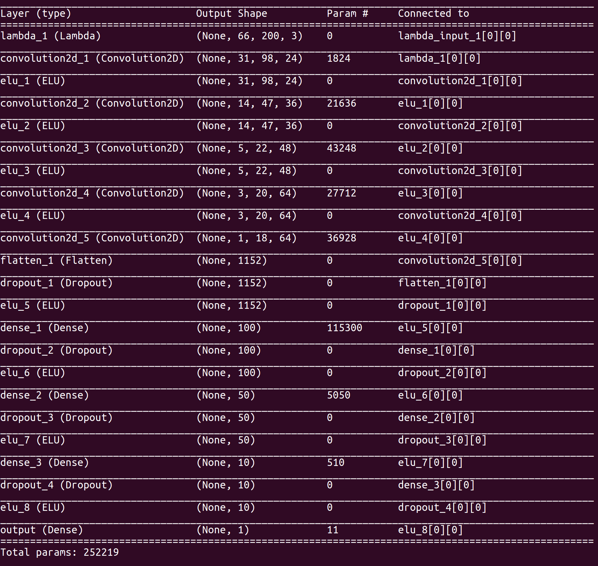

Data Collection
---------------
One of the tasks of this project was **data collection** using the simulator.
In the first phases of the project own data was collected using the keyboard
to drive the car. However after using the data for training we observed that
the keyboard input was really bad, since it provided almost binary commands,
instead of a continuous range of steering angles.

Most of students recommended the use of a joystick for the project, which
unfortunately we did not have access to. Fortunately, we were provided with
a **dataset from Udacity**, which is what we used in the project.

Nonetheless, it's worthwhile describing here the process that we followed
to manually record training data.

### Strategy
We recorded data in the following way, keeping a constant speed of 30 mph:

- **Normal driving**, with the vehicle kept in the center of the road.
Approximately 3 laps of driving. Example images:

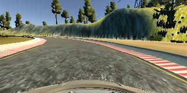 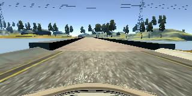


- **Recovery**. This part is crucial to manage to get the car driving
the whole lap. Without it, it cannot recover from getting off-center (and
no matter what you do, this will always happen).
First, we drove towards the left or right edge of the road,
without recording. Then we turned on recording, and steered the vehicle back on
track. This was performed at different distances from the center of the lane.
We took 2 laps of recording the vehicle recovering from left to center,
and another 2 laps of recovery from right to center. Example images:

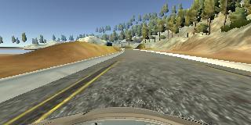 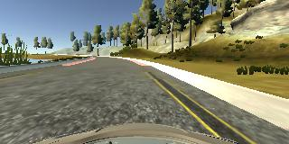

It was not necessary to drive in the opposite direction, since we extend
the dataset by flipping the image, as will be described later.

### Udacity's dataset
As mentioned before, the final model was trained using Udacity's dataset.
The log file contains 8036 timestamps. For each of them, we have 3 RGB images
and one steering angle, already normalized. Therefore, the complete
dataset contains **24108 images**.

Data Augmentation
-----------------
Below we describe the techniques used to generate additional training data.

### Use of left and right images
Even though the model will only use the center camera when testing, we can
use the left and right cameras for training. The only caveat is that
we are not provided with a steering angle for those, only for the center camera.

The solution is to add or subtract an offset `ANGLE_OFFSET = 0.25` to the steering angle
of the center camera, for the left and right camera, respectively. This is similar
to having 3 cars driving in parallel, one at each camera position. Intuitively,
the image from the left camera will require a bigger turning angle to the right,
since it's closer to the left edge of the road. Similarly for the right camera.

The result can be observed in the following picture:
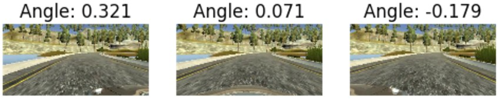

### Horizontal flipping

To avoid bias towards driving in only one direction of the track, we randomly
flip the images horizontally to emulate driving in the opposite direction.
Of course we need to negate the steering angle. This is accomplished with the
following code:

```python
def random_horizontal_flip(x, y):
    flip = np.random.randint(2)

    if flip:
        x = cv2.flip(x, 1)
        y = -y

    return x, y
```

Example case:

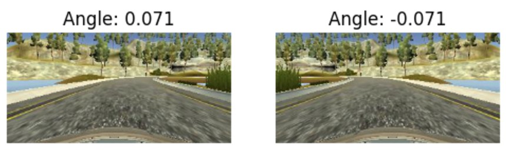


### Random horizontal shift

Finally, we generate even more data by performing random horizontal shifts
to the image. This is equivalent to having an infinite number of camera
positions between the left and right camera. 

We set a maximum translation range of +- 50 pixels, which we observed is approximately
the distance between the left/right and center camera. This is implemented as
follows:

```python
def random_translation(img, steering):
    # Maximum shift of the image, in pixels
    trans_range = 50  # Pixels

    # Compute translation and corresponding steering angle
    tr_x = np.random.uniform(-trans_range, trans_range)
    steering = steering + (tr_x / trans_range) * ANGLE_OFFSET

    # Warp image using the computed translation
    rows = img.shape[0]
    cols = img.shape[1]

    M = np.float32([[1,0,tr_x],[0,1,0]])
    img = cv2.warpAffine(img,M,(cols,rows))

    return img, steering
```

Example results:

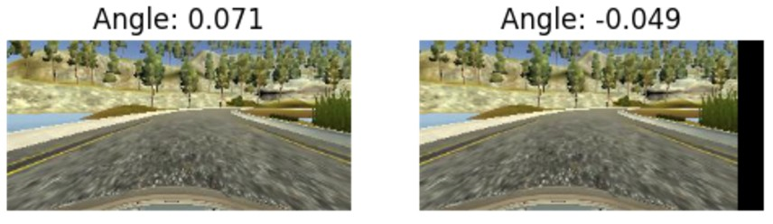


Data Preprocessing
------------------
Before sending the input images to the neural network, we perform the following
preprocessing steps:

1. Image resize to have a width of 200, keeping the aspect ratio.
2. Image crop to have a height of 66. We remove the pixels from the top of the
   the image, since they belong to the sky, which contains no relevant information.

We do **not** convert the RGB images to YUV, as proposed by Nvidia. We tested
it but provided no real improvement over the raw RGB data, as confirmed by
other students. Therefore we skipped this step to have a faster pipeline.

This pipeline is implemented in a separate file, `preprocess_input.py`,
so it can be use both by `model.py` and `drive.py`:

```python
FINAL_IMG_SHAPE = (66, 200, 3)

def resize(x):
    height = x.shape[0]
    width = x.shape[1]

    factor = float(FINAL_IMG_SHAPE[1]) / float(width)

    resized_size = (int(width*factor), int(height*factor))
    x = cv2.resize(x, resized_size)
    crop_height = resized_size[1] - FINAL_IMG_SHAPE[0]

    return x[crop_height:, :, :]
```

In addition, we perform **image normalization** to the range [-0.5, 0.5]
in the model using a `Lambda` layer:

```python
def normalize(X):
    """ Normalizes the input between -0.5 and 0.5 """
    return X / 255. - 0.5
```
```python
model.add(Lambda(normalize, input_shape=input_shape, output_shape=input_shape))
```


Data Generator
--------------
The amount of collected data is very large: thousands of medium-resolution
images. During training, we realized it's impossible to read them all from
the hard disk and keep them in RAM, since it was just too much memory.

The solution was found thanks to Slack and Confluence forums: use a
**Python generator**, which reads a batch at a time and performs preprocessing
and dataset extension on-the-fly. The main advantage is that it can be
applied to any input dataset, no matter how big it is.

### Train generator

The generator for training data performs the following operations:

1. Read random image from file.
2. Randomly select which of center, right or left image to use.
3. Preprocess the image.
4. Perform data augmentation (random flipping, random shift, etc).
5. Append image to output batch.
6. Yield the batch after it has been filled.

This is implemented in the following code snippet:

```python
def train_generator(X, y, batch_size):
    """ Provides a batch of images from a log file. The main advantage
        of using a generator is that we do not need to read the whole log file,
        only one batch at a time, so it will fit in RAM.
        This function also generates extended data on the fly. """
    # Supply training images indefinitely
    while 1:
        # Declare output data
        x_out = []
        y_out = []

        # Fill batch
        for i in range(0, batch_size):
            # Get random index to an element in the dataset.
            idx = np.random.randint(len(y))

            # Randomly select which of the 3 images (center, left, right) to use
            idx_img = np.random.randint(len(ANGLE_OFFSETS))

            # Read image and steering angle (with added offset)
            x_i = mpimg.imread(X[idx][idx_img].strip())
            y_i = y[idx] + ANGLE_OFFSETS[idx_img]

            # Preprocess image
            x_i = preprocess_input.main(x_i)

            # Augment data
            x_i, y_i = data_augmentation(x_i, y_i)

            # Add to batch
            x_out.append(x_i)
            y_out.append(y_i)

        yield (np.array(x_out), np.array(y_out))

```

### Validation generator

We also implement a generator to provide validation data. We cannot use
the training generator for this, since **we want to keep the validation data
constant** to properly evaluate the network. This is not possible with the
previous generator since it performs random data augmentation.

The validation generator is then a stripped-off version of the previous, that
simply reads the images and applies preprocessing. We always read the center
image here, since it's the one that contains the true associated steering angle.
For validation, it is not required to return batches so we just yield
individual images.

```python
def val_generator(X, y):
    """ Provides images for validation. This generator is different
        from the previous one in that it does **not** perform data augmentation:
        it just reads images from disk, preprocess them and yields them """
    # Validation generator
    while 1:
        for i in range(len(y)):
            # Read image and steering angle
            x_out = mpimg.imread(X[i][0].strip())
            y_out = np.array([[y[i]]])

            # Preprocess image
            x_out = preprocess_input.main(x_out)
            x_out = x_out[None, :, :, :]

            # Return the data
            yield x_out, y_out
```


Training Strategy
-----------------
The training process was performed using the following configuration:

- **Optimization parameter**: Mean Square Error (mse), since this is a regression
problem.

- **Optimizer**: Adam, given the great performance on the Traffic Signs Lab.
We use a learning rate of 0.001 (default value). Smaller values like 0.0001 and
0.00001 were also tested, but 0.001 gave the best performance.

- **Metrics**: none, just the loss. We observe that the `accuracy` metric
was quite useless (stayed at around all the time 33%), since it's more
relevant in classification problems. Here the best available indicator of the
performance of the network is really the validation loss.
However we realized soon that to really evaluate the performance we must
run the model on the simulator, since the loss is not 100% reliable either.

- **Batch size**: 64, to fit in GPU memory.
- **Number of training samples**: around 40000.
- **Maximum number of epochs**: 20.
- **Callbacks**: we implement a callback to save the model after every epoch, in
case the validation loss was the best so far. This way we can compare
different models while skipping the ones with worse perforance. This is
implemented in the `EpochSaverCallback` class:

```python
class EpochSaverCallback(Callback):
    def __init__(self, out_dir):
        self.out_dir = out_dir

    def on_train_begin(self, logs={}):
        self.losses = []

    def on_epoch_end(self, epoch, logs={}):
        current_loss = logs.get('val_loss')

        if not self.losses or current_loss < np.amin(self.losses):
            out_dir = os.path.join(self.out_dir, 'e' + str(epoch+1))
            save_model(out_dir, self.model)

        self.losses.append(current_loss)
```


The function `fit_generator` was used, in order to take advantage of the
Python generator and be able to process the complete dataset in every epoch.
The train and validation datasets are always shuffled at the
beginning of every epoch.


Validation and Testing
----------------------
This project was really a challenge in terms of validation and testing, since
it was completely different from the traditional Machine Learning/Deep Learning
approach that we have studied so far.

After a lot of trial and error, we reached the conclusion, as many other
students, that **for this project the only reliable test is the simulator**.
Thus, it was really **pointless to have a test set** except for debugging
purposes, since it would take away precious training data with no real reward.

When it comes to **validation**, we found similar results. We started off
using the `train_test_split` function to create train and validation datasets.
Then, we performed training looking at the validation loss (since accuracy
is not useful at all for this project). However we noticed that
**the best model is not the one with the lowest validation loss**. Thus the
validation set proved only useful to see if the training process was going
well (i.e. the loss going down), but wasn't really an indicator of how
well the model would perform on the simulator.

In the final model, this is what has been done regarding train, validation
and test sets:

- **Training set**. Start with all the images from the log file and perform
**data augmentation** to obtain around 40.000 images. Notice that since there
is always a random shift,
**any image in the train set is different from the ones in the log file**.

- **Validation set**. Use all the images from the log file, but
**without performing data augmentation**. This way, the validation and training
sets are actually different, so the validation procedure is still _valid_. The
advantage is that we don't have to take away data from the training set; we can
use all of it and augment it.

- **Test set**. Not existing. The test that really matters is the simulator.


Test Results
------------------
After training, we evaluate the performance on the simulator for both tracks.
The following settings have been used:

- Screen resolution: 1024x768.
- Graphics quality: Fastest.

### Track 1
On Track 1, the car manages to successfully complete the whole lap, and it can
continue driving indefinitely (at least we tested for one hour).

It is a bit wobbly and it gets really close to the edge in the first sharp
curve after the bridge (almost touching the line), but overall the performance
is very good.

See `track1.mkv` for full demostration.

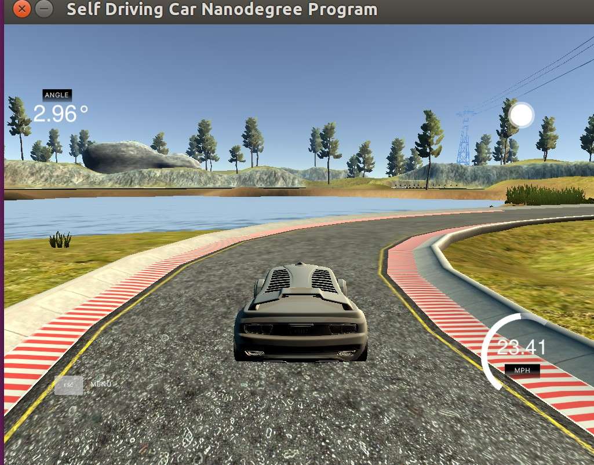

### Track 2
On Track 2, the learning generalizes fairly well and the car is able to follow
the road. However, in some sharp curves the car is a bit too slow to react
and ends up very close to the edge. In one of them it's too late and ends up
crashing into the guardrail.

Further tuning would make the car react faster, but it would also move
less smoothly, more wobbly.

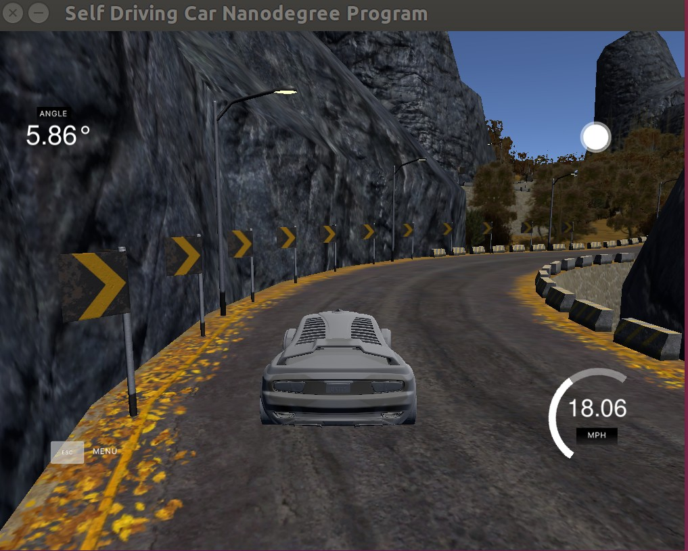


Conclusion
----------
This was by far the most challenging project from the CarND program.
There has been a lot of trial and error since it's really hard to tell
from the validation loss if the model is good or not - only the test on
simulator is the real indicator. 

Even though the model could be further improved by making the car react
earlier in time, the results are satisfactory and the car can drive indefinitely
on Track 1. With more time available better results could be achieved.

It's been very helpful to read Nvidia's paper, visit the comma.ai Github
repository and especially get help from fellow students in Slack and the
Forums.

