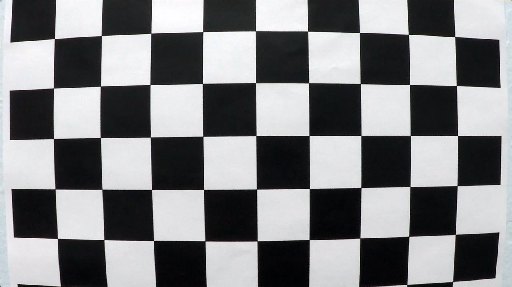
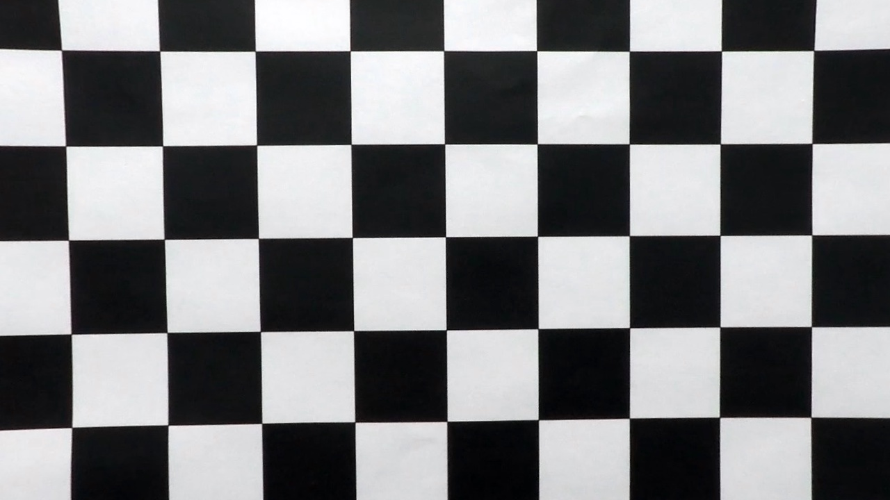
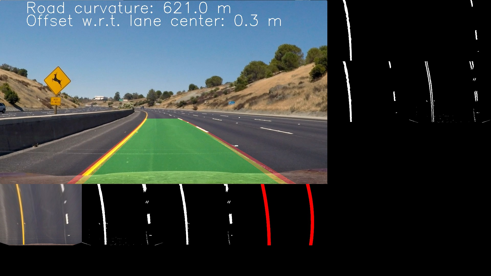
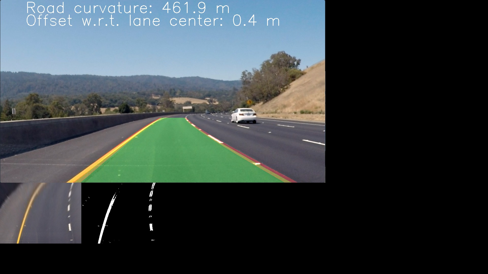

# Advanced Lane Finding


---

## General overview

## Camera calibration
The process of camera calibration consists on extracting the distortion
coefficients of the camera from a series of calibration images, that contain
a well-known pattern, like a checkerboard.

The first step is to extract the pixel coordinates of the corners of the
squares of the checkerboard, using the OpenCV function `cv2.findChessboardCorners`,
as shown in `checkerboard_corners.jpg`:


The procedure is applied to multiple images taken from different perspectives.

Once the corners have been collected, we pass them to the OpenCV function
`cv2.calibrateCamera`, which returns the distorsion coefficients necessary
to undistort an image:

```python
ret, mtx, dist, rvecs, tvecs = cv2.calibrateCamera(obj_pts, img_pts, gray.shape[::-1],None,None)
```


## Image undistortion
Once we have obtained the distortion coefficients, we can undistort any image
using the OpenCV function `cv2.undistort`. As an example, we apply it
to the image `img_distorted.jpg`, obtaining `img_undistorted.jpg`:





## Masking

### Region of Interest

### Color masks

### Gradient masks

### Final mask


## Perspective transformation


## Line search


## Line tracking

## Line fitting


## Road curvature estimation

## Vehicle position estimation

## Visualization


## Complete pipeline

## Results

### Test images







### Test video

### Challenge videos

## Conclusions
