# Advanced Lane Finding

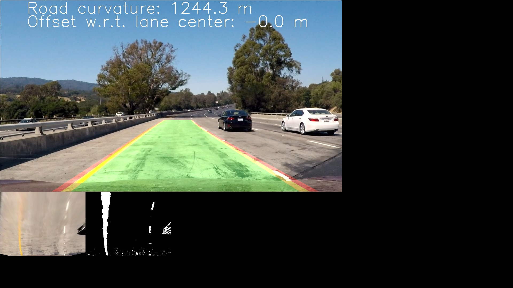

---

## General overview

The goals / steps of this project are the following:

1. Compute the camera calibration matrix and distortion coefficients given a set of chessboard images.
2. Apply a distortion correction to raw images.
3. Use color transforms, gradients, etc., to create a thresholded binary image.
4. Apply a perspective transform to rectify binary image ("birds-eye view").
5. Detect lane pixels and fit to find the lane boundary.
6. Determine the curvature of the lane and vehicle position with respect to center.
7. Warp the detected lane boundaries back onto the original image.
8. Output visual display of the lane boundaries and numerical estimation of lane curvature and vehicle position.

---

# Rubric Points

Here I will consider the rubric points individually and describe how I addressed
each point in my implementation. All the code references will be relative to
the iPython Notebook `p4-advanced-lane-finding.ipynb`, which contains the
complete implementation.

---

# Camera Calibration
**1. Have the camera matrix and distortion coefficients been computed correctly and checked on one of the calibration images as a test?**

The process of camera calibration consists on extracting the distortion
coefficients of the camera from a series of calibration images, that contain
a well-known pattern, like a checkerboard.

The first step is to extract the pixel coordinates of the corners of the
squares of the checkerboard, using the OpenCV function `cv2.findChessboardCorners`,
as shown in `checkerboard_corners.jpg`:

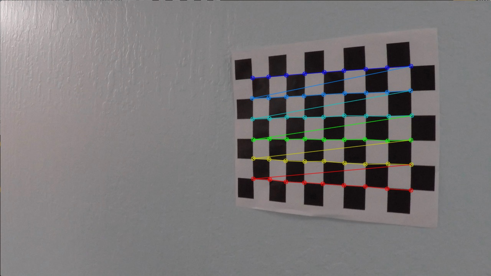

The 2D points obtained in this process are called `img_pts` in the code.
The procedure is applied to multiple images taken from different perspectives,
appending the extracted points to the `img_pts` array.

At the same time, we create the `obj_pts` array, which represents the real-world
3D coordinates of the previously mentioned `img_pts`. Here we assume that
the points lie on a plane at `z = 0`, and the squares in the image have a
size of 1 meter, with origin in the top-left square.

Once the corners have been collected, we pass them to the OpenCV function
`cv2.calibrateCamera`, which returns the distorsion coefficients necessary
to undistort an image:

```python
ret, mtx, dist, rvecs, tvecs = cv2.calibrateCamera(obj_pts, img_pts, gray.shape[::-1],None,None)
```

Once we have obtained the distortion coefficients, we can undistort any image
using the OpenCV function `cv2.undistort`. As an example, we apply it to `camera_cal/calibration1.jpg`,
obtaining `undistort_test.jpg`:


---

# Pipeline (single images)
**1. Has the distortion correction been correctly applied to each image?**

We apply this to a test image, for example `test6.jpg`, again using the `cv2.undistort` function.
The difference between the original and undistorted image is also shown:

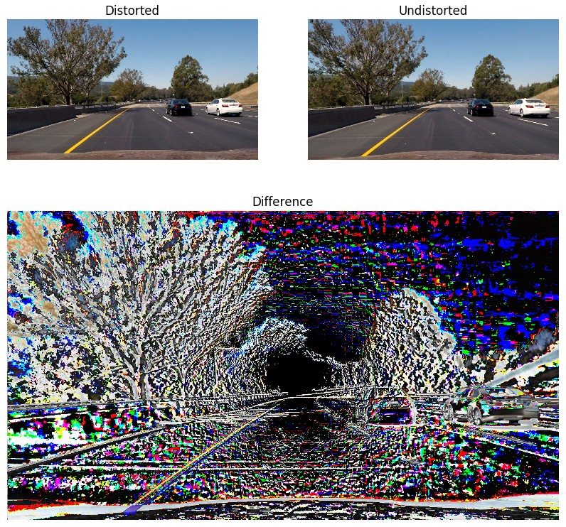

It can be seen that the main differences (non-zero pixels) are on the borders
of the image, where the image has more distortion. Apart from that, the changes
are barely noticeable by just looking at the two images, since the distortion
is not too large.

Finally, this process is applied as first step in the `LaneFindingPipeline::run` method:

```python
def run(self, img):
    # Undistort image
    img_undistort = undistort_img(img)
```

**2. Has a binary image been created using color transforms, gradients or other methods?**

Yes, a binary mask has been created in order to keep the pixels belonging to the
lane lines, removing as much as possible from the rest of the image. We have
used masks based on color and gradients.

### Color mask
To create a color mask, we converted the image to the HLS color space, and keep
the **saturation** channel, since the lane markings are usually quite saturated
in white or yellow. To do this, we used the function `cv2.cvtColor(img, cv2.COLOR_RGB2HLS)`,
and kept the third channel:

```python
def saturation_mask(img, thresh=(100,255)):
    # Convert to HLS
    img_hls = cv2.cvtColor(img, cv2.COLOR_RGB2HLS)
    
    # Create saturation mask
    s_mask = mask_img(img_hls[:,:,2], thresh)
    
    return s_mask
```

The result can be observed in `res/saturation_mask.jpg`:

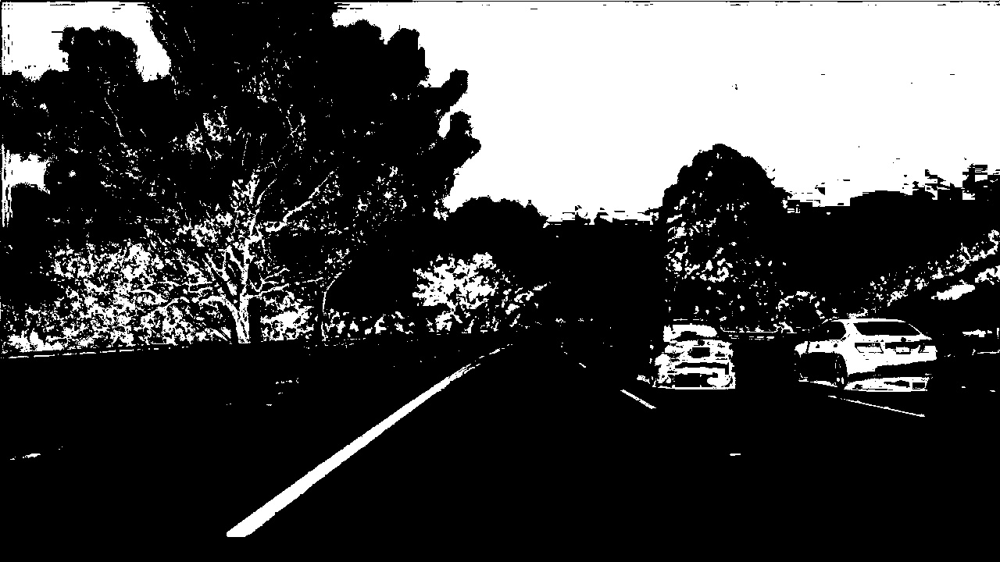

### Gradient mask

To make it more robust, we also compute a mask based on gradients. In particular,
we use the Sobel operator seen in the lectures. We experimented with gradients
in X and Y directions independently, gradient magnitude and direction (lots
of pictures can be found in the iPython notebook). The conclusions are:

 - Sobel in X direction is extremelly useful since the lane lines are vertical.
 Sobel Y can detect most of them as well, but return extra undesireable gradients
for example when having shadows across the road.

 - Gradient magnitude combines sobel X and Y, therefore keeping the problems of
 Sobel Y.

 - Gradient direction is extremelly noise and doesn't allow us to better
 extract the lane lines.

Therefore the chosen solution is to *only use the Sobel X mask*. An example
of this mask is shown in `res/sobel_x.jpg`:

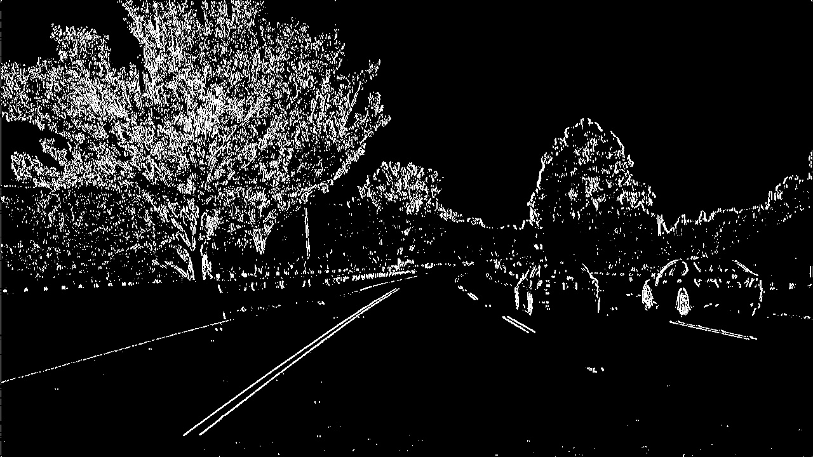


### Final mask

Finally, we combine the previous masks to get the best of both worlds using
and OR operation (addition):

```python
def combined_mask(img):
    # Color masks
    s_mask = saturation_mask(img)
    
    # Gradient masks
    sobel_x_mask = abs_sobel_mask(img, orient = 'x', thresh=(25,255))

    # Final mask
    mask = cv2.bitwise_or(s_mask, sobel_x_mask)
    return mask
```

The result is shown in `res/final_mask.jpg`:

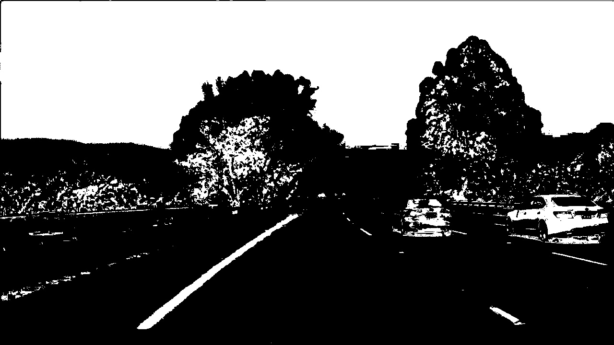

**3. Has a perspective transform been applied to rectify the image?**

One of the goals of the project is to compute the road curvature and
vehicle position within the lane. In order to do that, we must obtain
a _birds-eye view_ of the image, which allows us to obtain real measurements,
not affected by the perspective of the camera.

This operation is called _perspective transformation_. We use the OpenCV functions
`cv2.getPerspectiveTransform` and `cv2.warpPerspective` to this extent.
We need to manually select 4 points in the source image that lie on the same
plane. We take the image `test6.jpg` for this purpose since the road is almost straight,
compared to the other test images, which will make the process easier.

The chosen points can be seen in the red rectangle in
`persp_transform_original.jpg`:

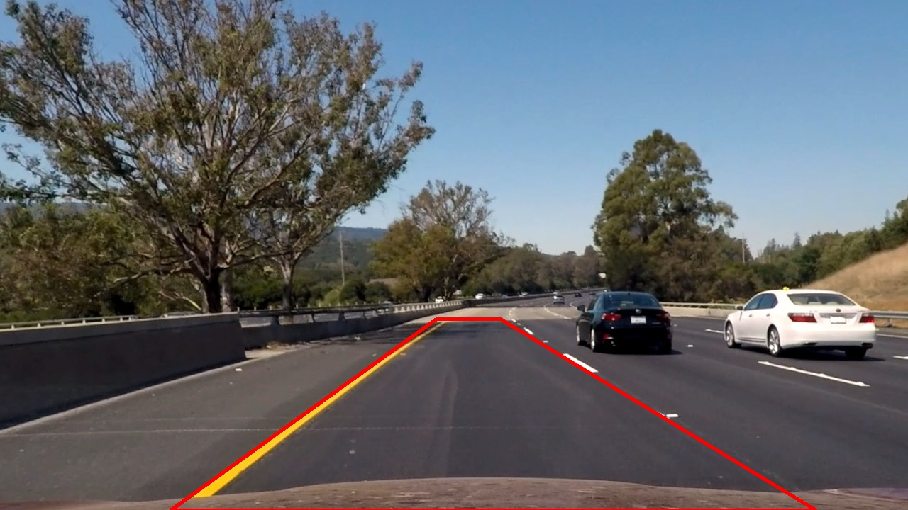

These 4 points are mapped into a real rectangle,
with parallel lines, as shown in `persp_transform_warped.jpg`:

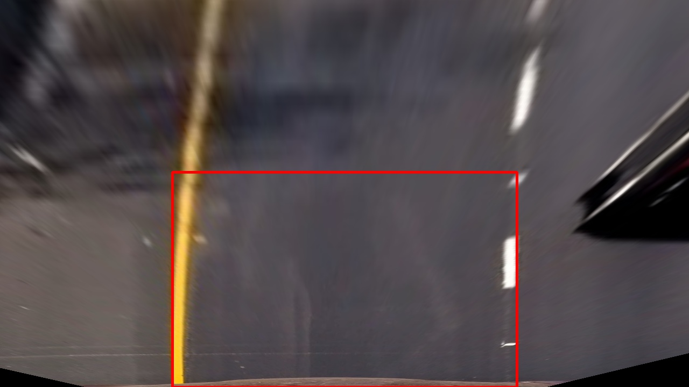

As can be seen, the road lines don't appear parallel in the original image
due to the camera perspective, but after the perspective transform they do
appear parallel, since we chose the 4 points carefully to do so.

The point correspondences are chosen as follows:

```python
k = 1.55
x1 = 240
x2 = 1155
src_pts_ = ((x1, img.shape[0]),
            (x2, img.shape[0]),
            (730, int(img.shape[0]/k)),
            (600, int(img.shape[0]/k)))

dst_pts_ = ((x1, img.shape[0]),
            (x2, img.shape[0]),
            (x2, 0),
            (x1, 0))  
```

which gives:

| src       |  dst      |
|:---------:|:---------:|
|240,  720  | 240, 720  |
|1155, 720  | 1155, 720 |
|730, 826   | 1155, 0   |
|600, 826   | 240, 0    |


**NOTE**: it is important that the `x` position for the points that lie on
the _bottom_ of the image are the same for `src` and `dst`, in order to
preserve the information about where in the lane the vehicle is. Otherwise
it could give a false impression that the vehicle is centered.

**4. Have lane line pixels been identified in the rectified image and fit with a polynomial?**

Yes. The process has been implemented in the following steps:

1. Search for the pixels belonging to the line, in the warped image.
2. Fit a second-order polynomial to each set of pixels.

We explain these 2 steps in the following sections.

### Line search

When we receive the first video frame, we have no information about the lane
lines in the image. Therefore we must perform a search without prior assumptions.
We will work with the birds-eye view image (warped image), passed through the
`final_mask()` function, as explained before.

The implemented approach is as follows:

1. Discover the starting point of the line, in the bottom of the image.
2. Follow the line all the way up to the top of the image, using a sliding
window technique.

#### Starting point

To search for the starting point of the lines, we compute the **histogram**
over the number of pixels for each `x` position in the image. To simplify
the computations and make it more robust, we only perform this operation
in the bottom half of the image.

The image we start with is shown in the figure `before_line_search.jpg`. It can
be seen it's a binary image (since it went through the mask) and it's warped
to be a birds-eye view.

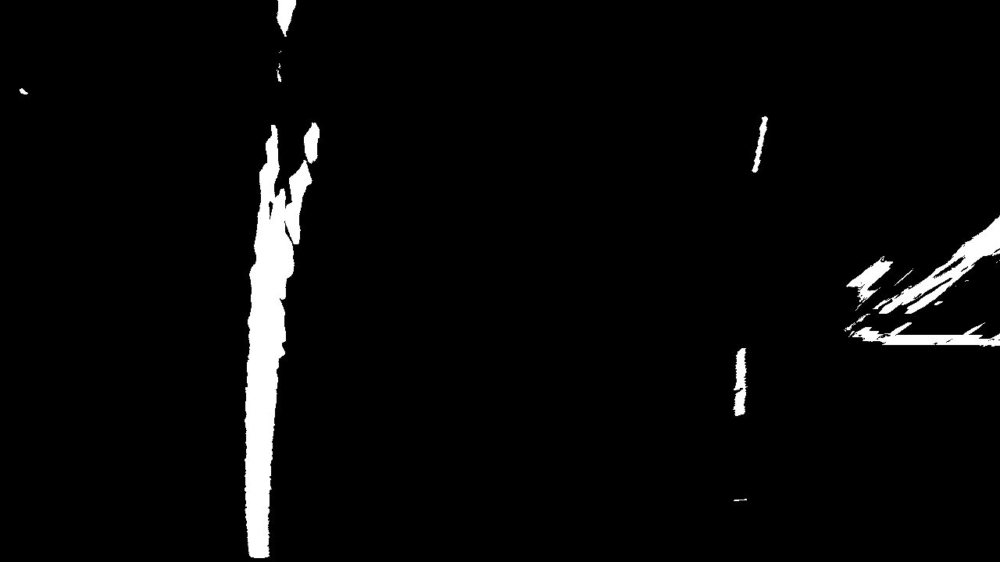

The histogram over non-zero pixels values is shown in
`line_search_initial_point.jpg`:

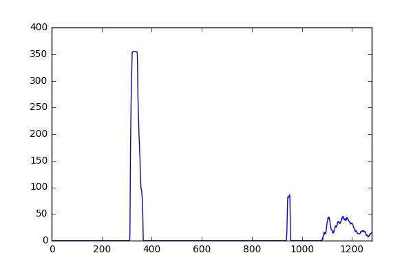

This is performed with the following code:

```python
def get_starting_x(img, visualize=False):
    # Compute histogram
    histogram = np.sum(img[int(img.shape[0]/2):,:], axis=0)
    
    if visualize:
        plt.plot(histogram);
        plt.autoscale(enable=True, axis='x', tight=True);
        plt.savefig('./res/line_search_initial_point.jpg')
        
    # Get left and right peaks. Assuming that left and right
    # lines will be on the left or right half of the image
    x_half = int(len(histogram)/2)
    x0_left  = np.argmax(histogram[0:x_half])
    x0_right = x_half + np.argmax(histogram[x_half:])
    
    return x0_left, x0_right
```

It can clearly be seen that there are 2 main peaks, which correspond to the starting
position of the lines.

#### Sliding window

We now know where to start searching. The next step is to place a box around
this starting point, extract the non-zero pixels inside it, and then move it
upwards following the line, all the way up to the top of the image.

The sliding window is moved as follows:

 - It moves the amount `size_y` in the vertical direction, where `size_y` is the
size of the window.
 - If the window contained pixels, it moves towards the mean `x` position of those
pixes. Otherwise it moves the same amount as in the previous step, assuming
that the line has the same curvature in the image.

This functionality is implemented in the `SlidingWindow` class.

An example is shown for both the left and right images, respectively, in
`sliding_window_search_left.jpg` and `sliding_window_search_right.jpg`. The red
squares represent the different positions of the sliding windows while searching
for the line pixels.

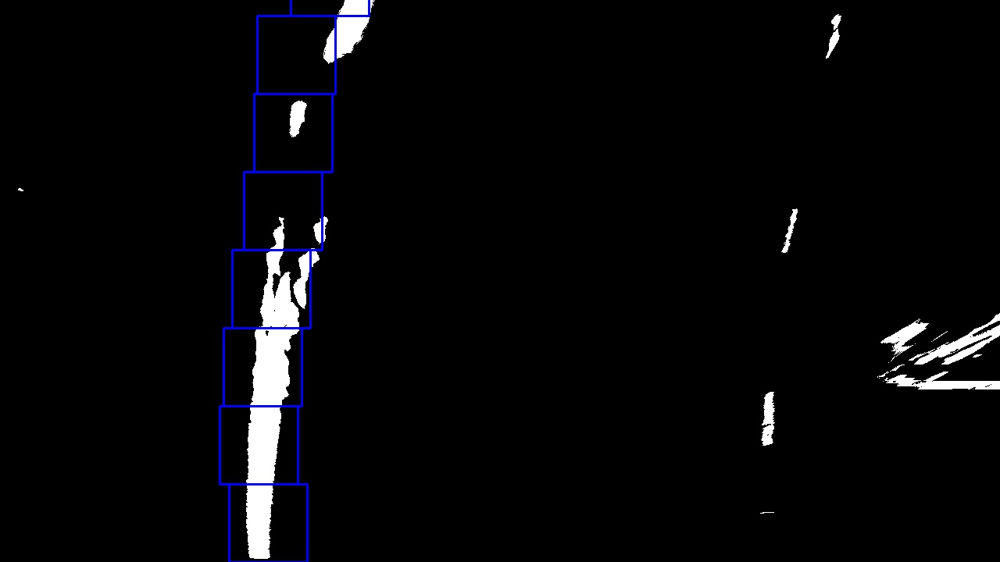
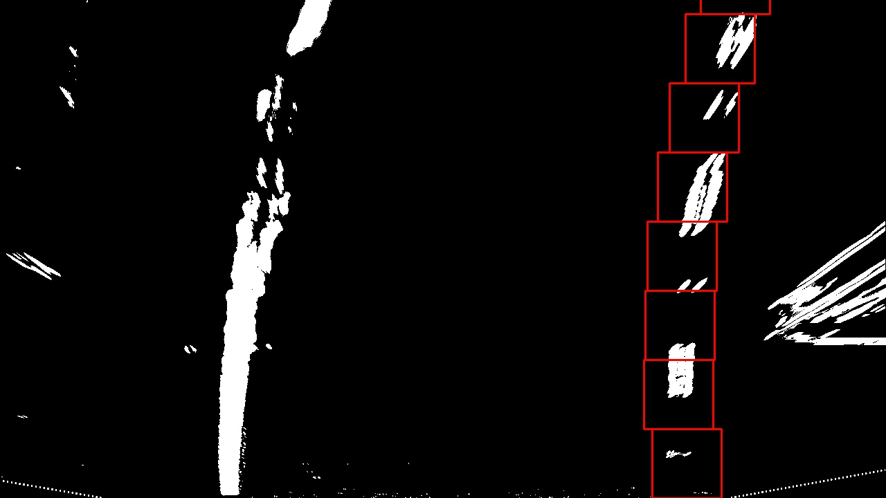

The final result is that each line contains a list of the `x` and `y` coordinates
of the pixels that it contains.

### Line fitting

Once we have the pixels for each line, we can perform **line fitting**, where
we simply fit a second-order polynomial to the stored `x` and `y` datapoints.
This is performed using the function `np.polyfit(y, x, 2)`.

**NOTE**: we fit the polynomial using `y` as `x` and viceversa for a more stable
result (since the lines are almost vertical) and since it will be useful later
on for drawing purposes.

Finally, we plot the polynomial on top of the original image by just computing
the corresponding `x` value for every `y` in the image. We use the function
`cv2.line` to plot the lines, as seen in pictures `line_fit_left.jpg` and
`line_fit_right.jpg`:

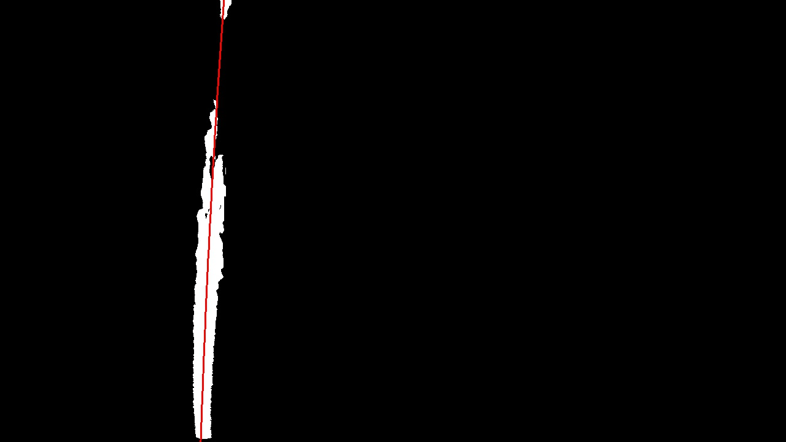
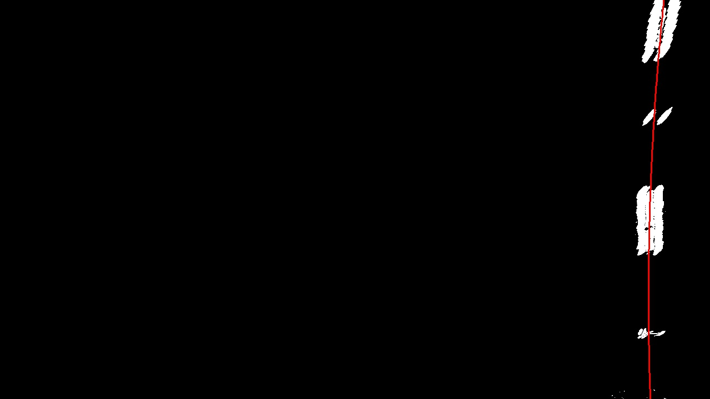

**NOTE**: we perform fitting both in pixel coordinates and in meters, to
obtain the coefficients `self.coeffs` and `self.coeffs_m`, inside the `Line`
class, respectively. The first ones are useful for drawing on the image;
the second ones will be useful for computing the road curvature and vehicle position.

**5. Having identified the lane lines, has the radius of curvature of the road been estimated? And the position of the vehicle with respect to center in the lane?**

Yes.

### Road curvature estimation
The road curvature is first estimated for the left and right lines. We have
used the formula provided in the lectures, implemented as follows in Python, inside
the `Line` class:

```python
def curvature(self, y_pos_pixels):
    y = y_pos_pixels * self.ym_per_pix
    
    dx_dy   = 2. * self.coeffs_m[0] * y + self.coeffs_m[1]
    d2x_dy2 = 2. * self.coeffs_m[0]
    
    curvature = ((1. + (dx_dy)**2)**1.5) / np.absolute(d2x_dy2)
    return curvature
```

We compute the curvature at the position `y_pos_pixels = img.shape[0]`, in other
words the bottom of the image, which is where the vehicle is. In addition,
we must not forget to convert from pixels to meters using the following
conversion factor, obtained from the lectures:

```python
self.ym_per_pix = 30/720  # meters per pixel in y dimension
self.xm_per_pix = 3.7/700 # meteres per pixel in x dimension
```

We are using `self.coeffs_m`, which means the coefficients of the polynomial
that was fit using data in meters, not in pixels.

Finally, we compute the final curvature as the average of the left and right
curvatures:

```
def compute_curvature(lane, img_shape):
    y_curvature = img_shape[0]
    return 0.5 * (lane.line_l.curvature(y_curvature) + lane.line_r.curvature(y_curvature))
```

### Vehicle position estimation
The vehicle offset with respect to the lane is computed by calculating
the position (in meters) of the left and line lanes at the bottom of the image.

We do this with the function `get_x_position` inside the `Line` class:

```python
def get_x_position(self, y_pixels, img_width):
    x_pixels = self.coeffs[0]*(y_pixels**2) + self.coeffs[1]*y_pixels + self.coeffs[2] \
               - float(img_width)/2
    return self.xm_per_pix * x_pixels   
```

Given a query position `y_pixels = img.shape[0]`, we first compute the corresponding
`x_pixels` position, in pixels, using the formula from the lectures. We substract
half of the image width to compute the offset with respect to the center.
**NOTE**: this assumption means that the camera is perfectly centered in the vehicle.

Finally, we convert to meters using the `self.xm_per_pix` factor. The final
vehicle position is the average of the positions for the left and right lines:

```python
def compute_vehicle_position(lane, img_shape):
    return 0.5 * (lane.line_r.get_x_position(img_shape[0], img_shape[1]) + \
                  lane.line_l.get_x_position(img_shape[0], img_shape[1]))
```

### Visualization
** 6. Has the result from lane line detection been warped back to the original image space and displayed? **

Yes, this is implemented in the `generate_output_img` function:

```python
def generate_output_img(img_original, lane, curvature, lane_offset):
    # Copy warped image
    img_lines = np.zeros_like(img_original)
    img_free_space = np.zeros_like(img_original)

    # Draw lines
    draw_line(img_lines, lane.line_l, thickness = 50)
    draw_line(img_lines, lane.line_r, thickness = 50)    

    # Draw free space
    draw_free_space(img_free_space, lane)
    
    # Unwarp images
    img_free_space_unwarp = cv2.warpPerspective(img_free_space, Minv, (img_original.shape[1], img_original.shape[0])) 
    img_lines_unwarp = cv2.warpPerspective(img_lines, Minv, (img_original.shape[1], img_original.shape[0])) 

    # Blend with original image
    img_out = cv2.addWeighted(img_original, 1, img_lines_unwarp, 0.3, 0)
    img_out = cv2.addWeighted(img_out, 1, img_free_space_unwarp, 0.3, 0)
    
    # Print curvature and lane offset
    font = cv2.FONT_HERSHEY_SIMPLEX
    color = (255, 255, 255)
    scale = 2
    thickness = 2
    cv2.putText(img_out, "Road curvature: %.1f m" % curvature, (100, 50), font, scale, color, thickness)
    cv2.putText(img_out, "Offset w.r.t. lane center: %.1f m" % lane_offset, (100, 100), font, scale, color, thickness)    
    
    return img_out

```

The steps are:

* Draw the left and right lanes on an empty image, using the function `draw_line`:

```python
def draw_line(img, line, color = (255,0,0), thickness = 4):
    # Get line points
    xvals, yvals = get_line_points(img, line)

    # Draw line
    for i in range(len(yvals) - 1):
        p1 = (int(xvals[i  ]), int(yvals[i  ]))
        p2 = (int(xvals[i+1]), int(yvals[i+1]))
        
        cv2.line(img, p1, p2, color=color, thickness=thickness)   
    return img
```
* Draw the empty space on a separate image, using the function `draw_free_space`:

```
def draw_free_space(img, lane, color = (0, 255, 0)):
    # Get line points
    xvals_l, yvals_l = get_line_points(img, lane.line_l)
    xvals_r, yvals_r = get_line_points(img, lane.line_r)
    
    # Recast the x and y points into usable format for cv2.fillPoly()
    pts_left = np.array([np.transpose(np.vstack([xvals_l, yvals_l]))])
    pts_right = np.array([np.flipud(np.transpose(np.vstack([xvals_r, yvals_r])))])
    pts = np.hstack((pts_left, pts_right))
    
    # Draw into image
    cv2.fillPoly(img, np.int_([pts]), color)

    # Return
    return img
```

An exmaple is shown in `res/free_space.jpg`:

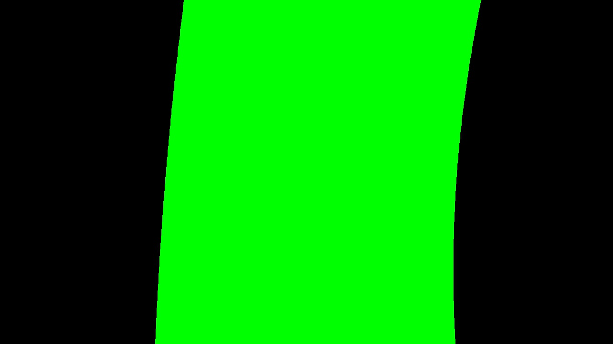


* Unwarp the previous two images back to the original perspective. This is
implemented using the `cv2.warpPerspective` function, using the `Minv` transformation
matrix instead of `M` (used to get the birds-eye view).

* Blend the previous unwarped images with the original one, using the
function `cv2.addWeighted`.

* Display the road curvature and vehicle position using the `cv2.putText` function.

An example result is shown in `res/main_visualization`:

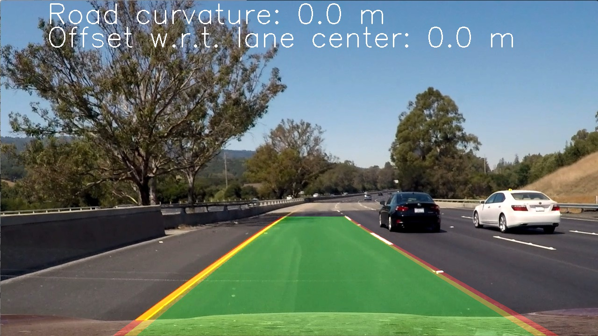

In addition, a debug visualizer has been created that includes the previous
image as well as the relevant intermediate images in the pipeline. This
is accomplished by simply creating a bigger image and copying the contents of the smaller
images inside. And example is shown in `output_images/test6.jpg`:

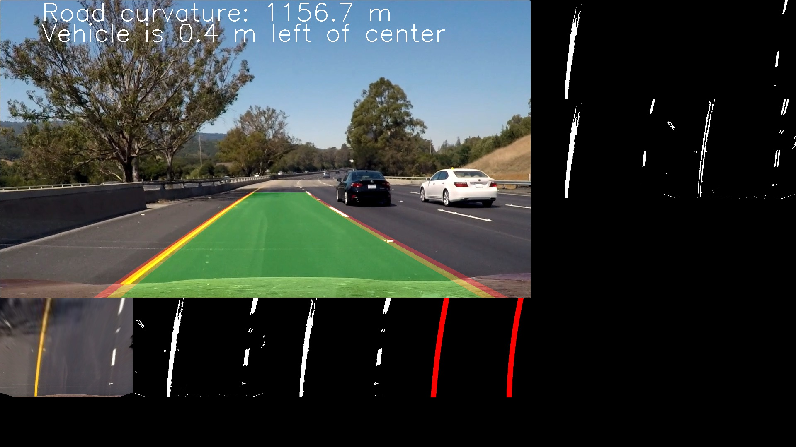

---

# Pipeline (video images)
**1. Does the pipeline established with the test images work to process the video?**

Yes, please look at the [output video](output_images/project_video.mp4).

The lines are correctly identified and tracked along the video frames.

**2. Has some kind of search method been implemented to discover the position of the lines in the first images in the video stream?**

Yes, this was done for the single image pipeline, please refer to [that section](#line-search).

**3. Has some form of tracking of the position of the lane lines been implemented?**
Yes, please see the section below.

### Line tracking

Once we have a first estimate of the line, we don't need to search in the whole
image. Instead, we create specific search regions for each line, assuming
that they will remain more or less similar from one frame to the next one.

We do this by simply adding an offset to the last coefficient of the polynomial,
which controls the `x` position of the line in the image. This is implemented in the `LineTracker`
class:

```python
def _offset_line_x(self, line, offset):
    # Copy line
    line_out = Line()
    line_out.coeffs = np.copy(line.coeffs)
    
    # Apply offset to the last coefficient
    line_out.coeffs[-1] = line_out.coeffs[-1] + offset
    
    return line_out
```

We can therefore compute 2 new lines from the original line, which are translated in the `x`
direction a certain amount `offset`. Then we can create a function that
draws a binary mask between these 2 new lines, using the function `draw_free_space`
that was mentioned before:

```python
def _create_search_mask(self, img_warped):
    mask = np.zeros_like(img_warped)
    
    # Create lines to left and right of the actual line, with some offset
    offset = 100 # pixels
    
    fake_lane = Lane()
    fake_lane.line_l = self._offset_line_x(self.line, -offset)
    fake_lane.line_r = self._offset_line_x(self.line, offset)
    
    # Draw as in free space
    draw_free_space(mask, fake_lane, color = (1, 1, 1))        
    
    if self.visualization_name:
        plt.figure();
        plt.imshow(mask, cmap = 'gray')
        plt.title(self.visualization_name)
        save_doc_img(mask_to_rgb(mask), self.visualization_name)
    return mask
```

The result can be observed in `tracking_search_left.jpg` and `tracking_search_right.jpg`,
where I create binary mask that will be used to search for new line pixels in
the video frame:

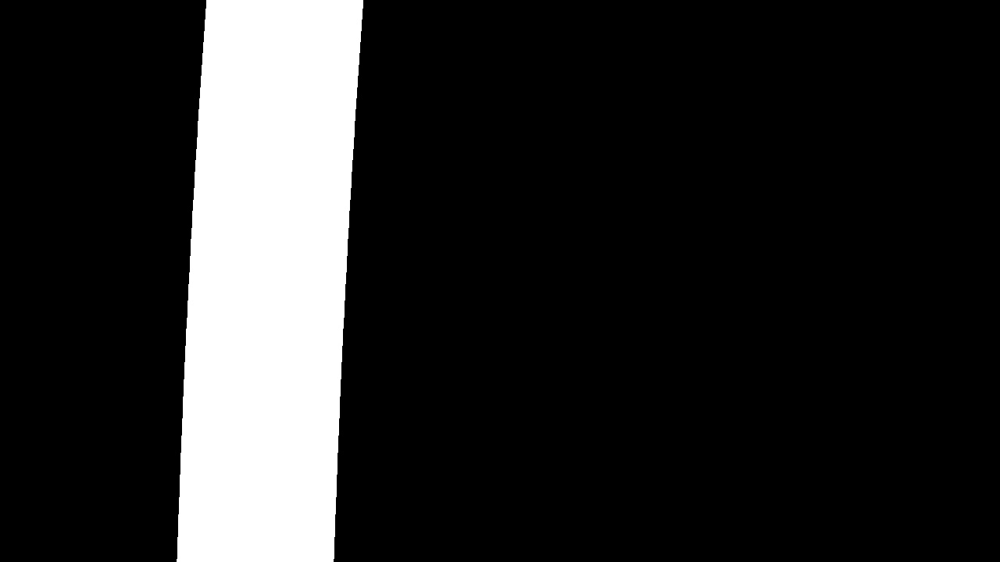
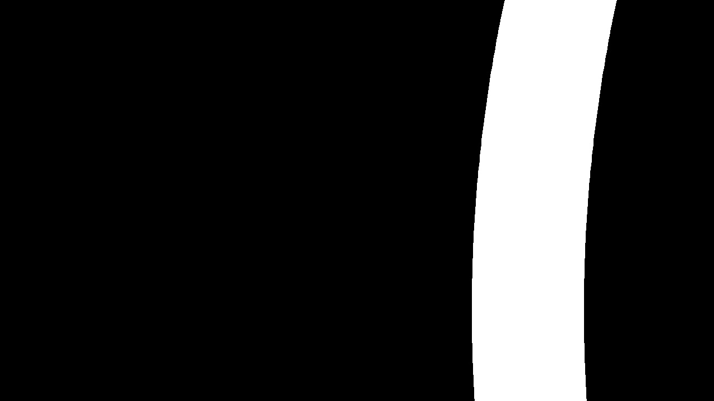

Then we simply extract the non-zero pixels in these regions and fit the line
polynomial as before. The process is faster and simpler since we only had to search
in a small region of the image.

### Line smoothing

---
# Readme
** Has a Readme file been included that describes in detail the steps taken to construct the pipeline, techniques used, areas where improvements could be made?**

Yes, you are reading it right now!

---

# Results

## Test images

For the test images, the lanes were detected without any issue:


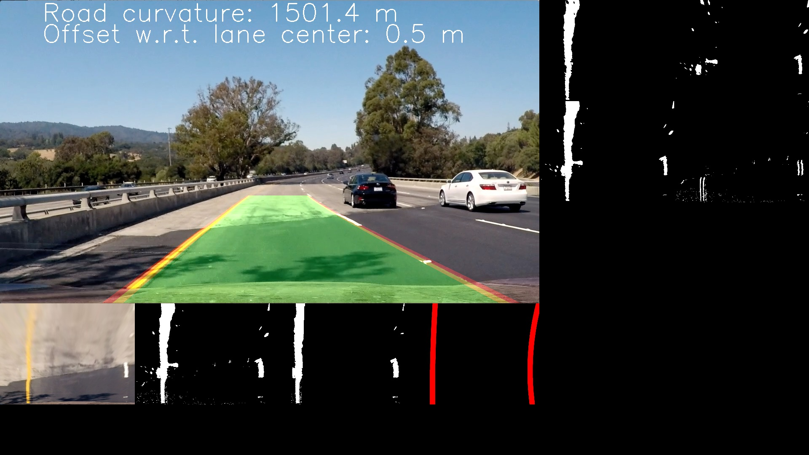

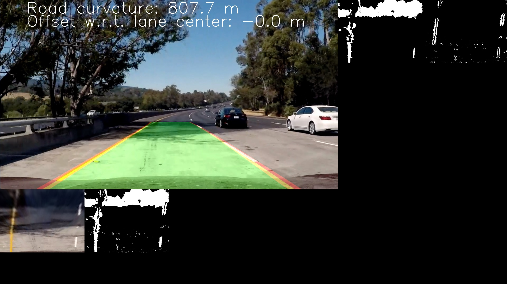


**NOTE**: I did not test the pipeline on images `test2.jpg` and `test3.jpg`
because they were cropped and therefore the perspective transformation
that worked with the other pictures were not working for these ones.
Ryan Keenan confirmed this and removed them from the Git repository.

## Test video

The pipeline also worked pretty well on the [project video](output_images/project_video.mp4).
Even though the binary masks didn't filter out some of the shadows, the lane
tracking and smoothing prevented the pipeline from outputting wild lines,
thus providing a robust and stable result.

## Challenge videos

The pipeline did not work so well on the challenge videos, mostly due
to sharper curves. The `harder_challenge` video even had zig-zag curves
that could not be approximated with a second-order polynomial - in this case,
a third order polynomial would have been better. However, this comes at the risk of
overfitting the line and sometimes getting strange polynomials.

# Discussion

This was indeed a very challenging project, showing us how hard traditional computer
vision is. It was a great learning experience after the Deep Learning projects,
showing us the two main approaches to solving computer vision problems in industry.

The hardest part was selecting and tuning the different color and gradient masks
in order to make a robust algorithm. This was mostly a trial-and-error process,
that could be a bit frustrating.

I am satisfied with the results on the test images, although I cannot really
say that it would be robust enough in any kind of scenario, especially in relation
to different weather conditions. After all, we only tested on well-illuminated
images. Most likely a more robust method should be implemented, but I really
doubt it could cope with the vast variety of situations that can occur.

For this reason, I believe that Deep Learning would have been a much better
approach for this problem (and any CV problem in general). This requires
however a lot of **labelled** data which might not be easily accessible.
There must therefore be a tradeoff between development effort, robustness
and access to labelled data.

