# Advanced Lane Finding


---

## Submission video

[](https://youtu.be/Nf094uOQrb8)

## General overview

The aim of this project is to design and implement a pipeline to
detect and track the position of the lane markings in a video feed.
To accomplish this, the following steps have been taken in this project:

1. Compute the camera calibration matrix and distortion coefficients given a set of chessboard images.
2. Apply a distortion correction to raw images.
3. Use color transforms, gradients, etc., to create a thresholded binary image.
4. Apply a perspective transform to rectify binary image ("birds-eye view").
5. Detect lane pixels and fit to find the lane boundary.
6. Determine the curvature of the lane and vehicle position with respect to center.
7. Warp the detected lane boundaries back onto the original image.
8. Output visual display of the lane boundaries and numerical estimation of lane curvature and vehicle position.

---

## Rubric Points

Here I will consider the rubric points individually and describe how I addressed
each point in my implementation. All the code references will be relative to
the iPython Notebook `p4-advanced-lane-finding.ipynb`, which contains the
complete implementation. In addition, there will be references to images
that can be found in the `output_images` folder.

Every rubric question is <mark>highlighted</mark> for the reader's convenience.

---

### Writeup / README

<mark>Provide a Writeup / README that includes all the rubric points and how you addressed each one.</mark>

This document is the required `README.md` file, describing how each rubric point
was addressed.

---

### Camera Calibration
<mark>Briefly state how you computed the camera matrix and distortion coefficients. Provide an example of a distortion corrected calibration image.</mark>

The process of camera calibration consists on extracting the distortion
coefficients of the camera from a series of calibration images, that contain
a well-known pattern, like a checkerboard.

The first step is to extract the pixel coordinates of the corners of the
squares of the checkerboard, using the OpenCV function `cv2.findChessboardCorners`.
This process takes place in `cell #3` in the iPython notebook.

The 2D points obtained in this process are called `img_pts` in the code.
The procedure is applied to multiple images taken from different perspectives,
appending the extracted points to the `img_pts` array.

An example of the extracted corners is shown in `checkerboard_corners.jpg`:

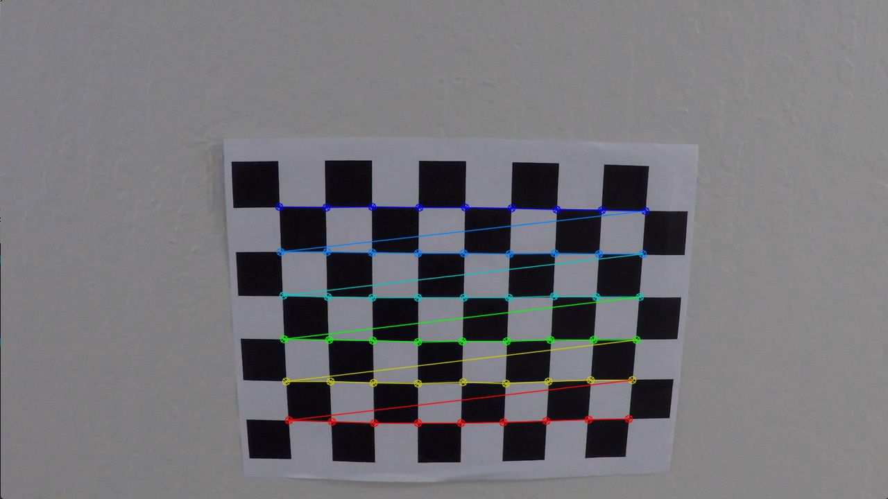


At the same time, we create the `obj_pts` array, which represents the real-world
3D coordinates of the previously mentioned `img_pts`. Here we assume that
the points lie on a plane at `z = 0`, and the squares in the image have a
size of 1 meter, with origin in the top-left square.

Once the corners have been collected, we can perform camera calibration using
the OpenCV function `cv2.calibrateCamera`, which returns the distorsion coefficients necessary
to undistort an image. This happens in `cell #4`:

```python
ret, mtx, dist, rvecs, tvecs = cv2.calibrateCamera(obj_pts, img_pts, gray.shape[::-1],None,None)
```

Once we have obtained the distortion coefficients, we can undistort any image
using the OpenCV function `cv2.undistort`, in `cell #5`.
As an example, we apply it to `camera_cal/calibration1.jpg`, obtaining `undistort_test.jpg`:

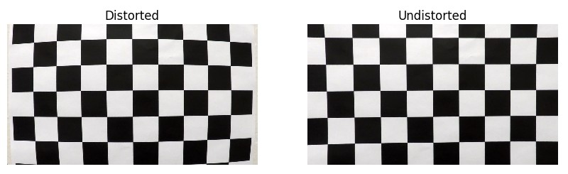

This test can be observed in `cell #6`.

---

### Pipeline (test images)
<mark>Provide an example of a distortion-corrected image.</mark>

We apply the distortion correction to a test image, for example `test6.jpg`, again using the `cv2.undistort` function. This process is executed in `cell #7`. The difference between the original and undistorted image is also displayed. The image corresponding to this
test is called `undistort_example.jpg`, as shown below:


It can be seen that the main differences (non-zero pixels) are on the borders
of the image, where the image has more distortion. Apart from that, the changes
are barely noticeable by just looking at the two images, since the distortion
is not too large.

This process is applied as first step in the `LaneFindingPipeline::run` method when
processing the video stream (see `cell #32`).

<mark>Describe how (and identify where in your code) you used color transforms, gradients or other methods to create a thresholded binary image. Provide an example of a binary image result.</mark>

A binary mask has been created in order to keep the pixels belonging to the
lane lines, removing as much noise/irrelevant pixels as possible from the rest
of the image. We have used masks based on color and gradients, which are described
in the following subsections.

#### Color masks

First, we create masks based on color. We know that the lane markings will
usually be either white or yellow, so we create masks for those two colors.

The first step is to convert the image to the `HLS` color space as follows:

```python
img_hls = cv2.cvtColor(img, cv2.COLOR_RGB2HLS)
```

The motivation is that the pure color information is more robustly contained in the `H` (hue)
channel. Another option would have been to choose `HSV` color space. However
we observed that it was trickier to properly isolate the white color.

The color masks are implemented in `cell #9`. In particular, the yellow and
white masks are obtained using the `cv2.inRange` function:

```python
def get_yellow_mask(img_hls):
    yellow_lower = np.array([15,50,100])
    yellow_upper = np.array([25,200,255])
    return cv2.inRange(img_hls, yellow_lower, yellow_upper) // 255
    
def get_white_mask(img_hls):
    white_lower = np.array([0,  200, 0])
    white_upper = np.array([255,255, 255])
    return cv2.inRange(img_hls, white_lower, white_upper) // 255
```

We apply these masks to the image `test5.jpg`, which is more challenging
due to the presence of shadows:


The result can be observed in `yellow_mask.jpg` (left) and `white_mask.jpg` (right):


The masks correctly extract the lane markings even in the presence of shadows.
The white mask extracts the white vehicle as well but this is not an issue,
since the perspective transform will allow us to only focus on the current lane.

#### Gradient mask

To make it more robust, we also compute a mask based on gradients. In particular,
we use the **Sobel operator** seen in the lectures, using the OpenCv function
`cv2.Sobel`. We have experimented with gradients
in X and Y directions independently, gradient magnitude and direction.
The implementation appears in `cell #10` and the tests can be observed
in `cell #11`. The conclusions are:

 - Sobel in X direction is extremelly useful since the lane lines are vertical.
 Sobel Y can detect most of them as well, but returns extra undesireable gradients
for example when having shadows across the road.

 - Gradient magnitude combines sobel X and Y, therefore keeping the problems of
 Sobel Y.

 - Gradient direction is extremelly noisy and doesn't allow us to better
 extract the lane lines.

Therefore the chosen solution is to **only use the Sobel X mask**. An example
of this mask is shown in `sobel_x.jpg`:

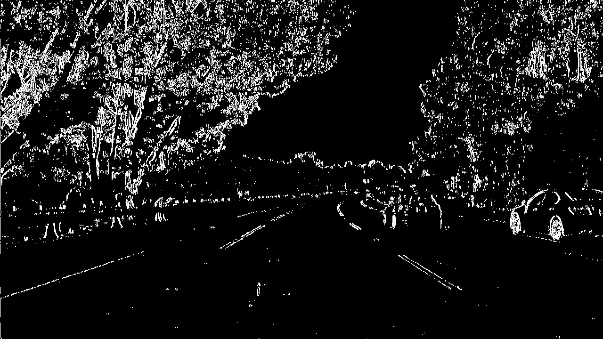

Again, the lane markings are very well detected on the image.

#### Final mask

Finally, we combine the previous masks to get the best of both worlds using
a **bitwise OR operation** (addition) of the yellow, white and gradient masks.
This is implemented in `cell #12`, using the function `cv2.bitwise_or`.

The result is shown in `final_mask.jpg`:

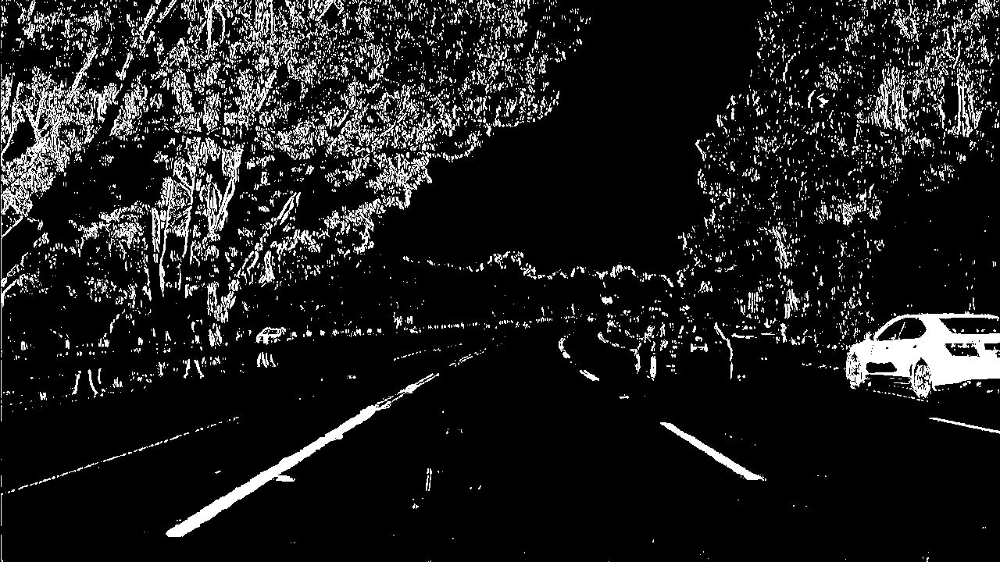

As can be observed, the lanemarkings are clearly detected all the way
forward to the horizon, and the shadows have been robustly filtered out. This
will make the process of lane fitting much easier.

<mark>Describe how (and identify where in your code) you performed a perspective transform and provide an example of a transformed image.</mark>

One of the goals of the project is to compute the road curvature and
vehicle position within the lane. In order to do that, we must obtain
a **birds-eye view** of the image, which allows us to obtain real measurements,
not affected by the perspective of the camera.

This operation is called **perspective transformation**, and it is implemented
in `cell #13`. We use the OpenCV functions
`cv2.getPerspectiveTransform` and `cv2.warpPerspective` to this extent.

First, we need to manually select 4 points in the source image. These points must
lie on the same plane. We take the image `test_images/straight_lines1.jpg`
for this purpose, since the road is straight.

The chosen points can be seen in the red polygon shown in
`persp_transform_original.jpg`:

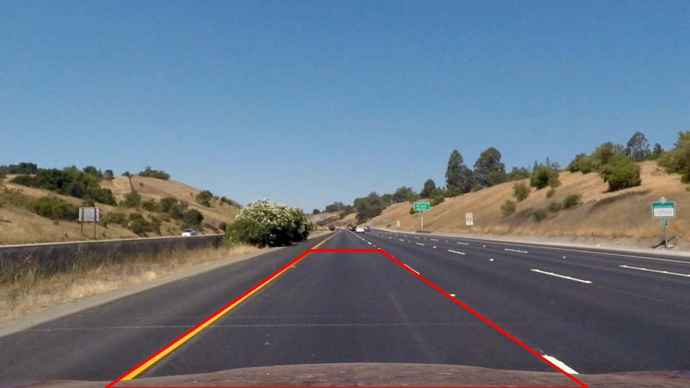

These 4 points are mapped into a rectangle,
with parallel lines, as shown in `persp_transform_warped.jpg`:

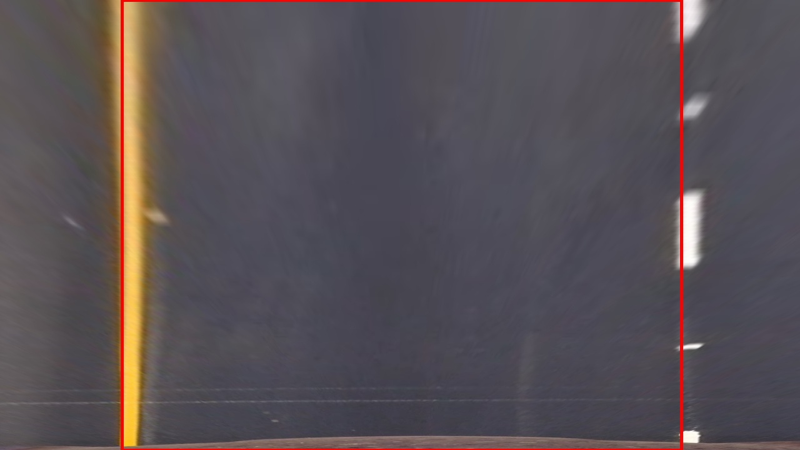

As can be seen, the road lines don't appear parallel in the original image
due to the camera perspective, but after the perspective transform they do
appear parallel, since we chose the 4 points carefully to do so. 

The point correspondences are chosen as follows:

```python
x1 = 195
x2 = 1090
y_horizon = 465
src_pts_ = ((x1, img.shape[0]),
            (x2, img.shape[0]),
            (705, y_horizon),
            (575, y_horizon))

off = 100 # Horizontal offset to have more space and better estimate sharp curves
dst_pts_ = ((x1 + off, img.shape[0]),
            (x2 - off, img.shape[0]),
            (x2 - off, 0),
            (x1 + off, 0))  
```

which gives:

| src       |  dst      |
|:---------:|:---------:|
|195,  720  | 295, 720  |
|1090, 720  | 990, 720  |
|705, 465   | 990, 0    |
|575, 465   | 295, 0    |


**NOTE**: it is important that the `x` position for the points that lie on
the _bottom_ of the image are equally scaled/offset when transforming from
`src` to `dst`, in order to preserve the information about where in the lane
the vehicle is. Otherwise it could give a false impression that the vehicle is centered.

<mark>Describe how (and identify where in your code) you identified lane-line pixels and fit their positions with a polynomial.</mark>

The process has been implemented in the following steps. The starting point
is the image obtained after applying the binary mask and the perspective
transform, discussed in previous sections. We will refer to this image as
`img_warped`:

1. Search for the pixels belonging to the line.
2. Fit a second-order polynomial to each set of pixels.

We explain these 2 steps in the following sections.

#### Line search

When we receive the first video frame, we have no information about the lane
lines in the image. Therefore we must perform a search without prior assumptions.
We will work with the birds-eye view image (`img_warped`), passed through the
`combined_mask()` function, as explained before.

The implemented approach is as follows:

1. Discover the starting point of the line, in the bottom of the image.
2. Follow the line all the way up to the top of the image, using a sliding
window technique.

The code that implements and verifies this part of the pipeline can be
observed from `cell #14` to `cell #24`.

#### Starting point

To search for the starting point of the lines, we compute the **histogram**
over the number of pixels for each `x` position in the image. To simplify
the computations and make it more robust, we only perform this operation
in the **bottom half of the image**. This is implemented in `cell #14`:

```python
def get_starting_x(img, visualize=False):
    # Compute histogram
    histogram = np.sum(img[int(img.shape[0]/2):,:], axis=0)
    
    if visualize:
        plt.plot(histogram);
        plt.autoscale(enable=True, axis='x', tight=True);
        plt.savefig('./output_images/line_search_initial_point.jpg')
        
    # Get left and right peaks. Assuming that left and right
    # lines will be on the left or right half of the image
    x_half = int(len(histogram)/2)
    x0_left  = np.argmax(histogram[0:x_half])
    x0_right = x_half + np.argmax(histogram[x_half:])
    
    return x0_left, x0_right
```


The image `img_warped` that we start with is shown in the figure
`before_line_search.jpg`:

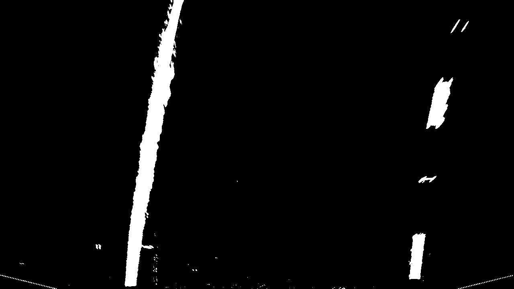

The histogram over non-zero pixels values is shown in
`line_search_initial_point.jpg`:

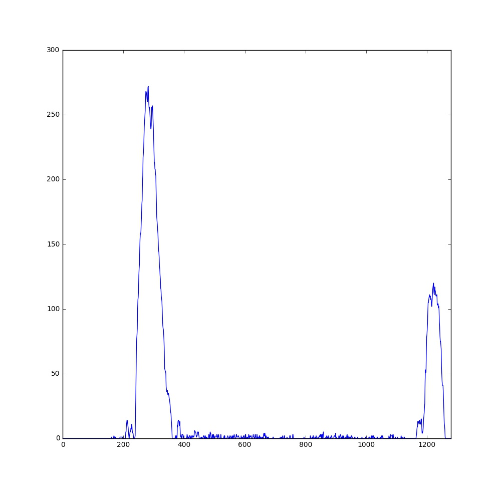

The result is the starting position of each line along the `x` direction, in pixels:

```
Left line at x = 339, right line at x = 1044
```

It can clearly be seen that there are 2 main peaks, which correspond to the starting
position of the lines.

#### Sliding window search

We now know where to start searching. The next step is to place a box around
this starting point, extract the non-zero pixels inside it, and then move it
upwards following the line, all the way up to the top of the image.

The sliding window is moved as follows:

 - It moves the amount `size_y` in the vertical direction, where `size_y` is the
size of the window.
 - If the window contained pixels, it moves towards the mean `x` position of those
pixes. Otherwise it moves the same amount as in the previous step, assuming
that the line has the same curvature in the image.

This functionality is implemented in the `SlidingWindow` helper class (see `cell #17`).
In addition, a `Line` class has been created to store the pixels extracted
from the sliding window.

The function that takes `img_warped`, the starting search position `x0` and
extracts the pixels corresponding to the line is called `get_line_pixels`,
implemented in `cell #20`.

An example is shown for both the left and right images, respectively, in
`sliding_window_search_left.jpg` and `sliding_window_search_right.jpg`. The red
squares represent the different positions of the sliding windows while searching
for the line pixels.

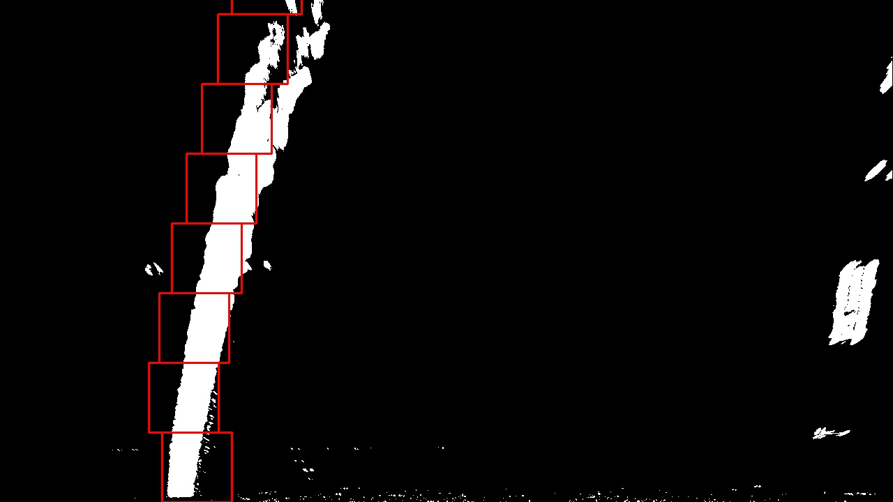
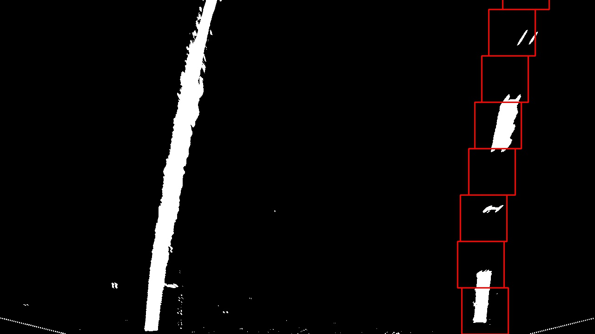

The final result is that each line contains a list of the `x` and `y` coordinates
of the pixels that it contains.

#### Line fitting

Once we have the pixels for each line, we can perform **line fitting**, where
we simply fit a second-order polynomial to the stored `x` and `y` datapoints.
This is performed using the function `np.polyfit(y, x, 2)`, inside the function
`fit` of the `Line` class (see `cell #15`).

**NOTE**: we fit the polynomial using `y` as `x` and viceversa for a more stable
result (since the lines are almost vertical) and since it will be useful later
on for drawing purposes.

Finally, we plot the polynomial on top of the original image by just computing
the corresponding `x` value for every `y` in the image. We use the function
`cv2.line` to plot the lines, inside the function `draw_line`, implemented
in `cell #21`.

The result can be seen in pictures `line_fit_left.jpg` (left) and
`line_fit_right.jpg`(right), with the polynomial overlaid in red. The shown
pixels are the ones that have been picked by the sliding window search.

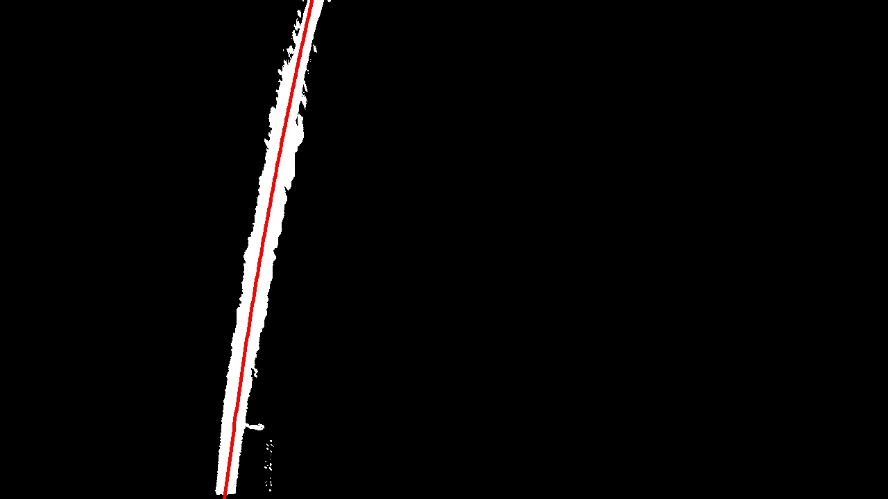
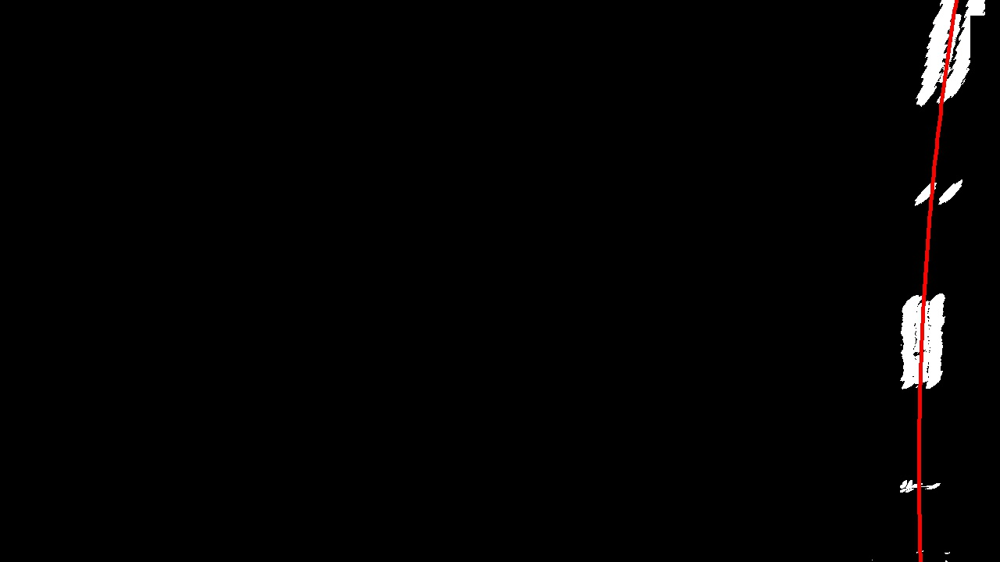

**NOTE**: we perform fitting both in pixel coordinates and in meters, to
obtain the coefficients `self.coeffs` and `self.coeffs_m`, inside the `Line`
class, respectively. For this, we need a conversion factor between pixels and meters,
which is also part of the `Line` class:

```python
self.ym_per_pix = 30/720  # meters per pixel in y dimension
self.xm_per_pix = 3.7/700 # meteres per pixel in x dimension
```

These are estimates taken from the Udacity class, assuming that the birds-eye
view image has 720 pixels in the vertical direction covering 30 meters of road,
and 700 pixels covering the lane width (around 3.7 meters).

 The first ones are useful for drawing on the image;
the second ones will be useful for computing the road curvature and vehicle position.

<mark>Describe how (and identify where in your code) you calculated the radius of curvature of the lane and the position of the vehicle with respect to center.</mark>


#### Road curvature estimation
To estimate the road curvature, we have used the formula provided in the lectures, implemented as follows in Python, inside the `Line` class (`cell #15`), function `curvature`:

```python
def curvature(self, y_pos_pixels):
    y = y_pos_pixels * self.ym_per_pix
    
    dx_dy   = 2. * self.coeffs_m[0] * y + self.coeffs_m[1]
    d2x_dy2 = 2. * self.coeffs_m[0]
    
    curvature = ((1. + (dx_dy)**2)**1.5) / np.absolute(d2x_dy2)
    return curvature
```

We compute the curvature at the position `y_pos_pixels = img.shape[0]`, in other
words the bottom of the image, which is where the vehicle is. In addition,
we must not forget to use `self.coeffs_m`, which contains the coefficients
after fitting X-Y points in meters, instead of pixels, obtained through
the conversion factors mentioned before.


Finally, we compute the final curvature as the average of the left and right
curvatures, in the function `compute_curvature`, (`cell #29`):

```
def compute_curvature(lane, img_shape):
    y_curvature = img_shape[0]
    return 0.5 * (lane.line_l.curvature(y_curvature) + lane.line_r.curvature(y_curvature))
```

#### Vehicle position estimation
The vehicle offset with respect to the lane is computed by calculating
the position (in meters) of the left and line lanes at the bottom of the image, relative
to the center of the image.

This is implemented in the function `get_x_position` inside the `Line` class (`cell #15`),
simply evaluating the second order polynomial at the desired `y` position. 

```python
def get_x_position(self, y_pixels, img_width):
    x_pixels = self.coeffs[0]*(y_pixels**2) + self.coeffs[1]*y_pixels + self.coeffs[2] \
               - float(img_width)/2
    return self.xm_per_pix * x_pixels   
```
It should be noted that we substract `img_width/2` in order to make the result relative
to the center of the image. **NOTE**: this assumption means that the camera is perfectly centered in the vehicle.

Finally, we convert to meters using the `self.xm_per_pix` factor. The final
vehicle position is the average of the positions for the left and right lines,
as shown in the function `compute_vehicle_position` (`cell #30`):

```python
def compute_vehicle_position(lane, img_shape):
    return 0.5 * (lane.line_r.get_x_position(img_shape[0], img_shape[1]) + \
                  lane.line_l.get_x_position(img_shape[0], img_shape[1]))
```
If the result is positive, it means that the lines appear more to the right
of the image, which means that the vehicle is offset to the left of the center lane.

<mark>Provide an example image of your result plotted back down onto the road such that the lane area is identified clearly.</mark>

The final visualization of the detected lanes is implemented in the `generate_output_img` function (`cell #26`)

The steps are:

1. Draw the left and right lanes on an empty image, using the function `draw_line`,
based on `cv2.line` (see `cell #21`).

2. Draw the empty space on a separate image, using the function `draw_free_space`,
based on `cv2.fillPoly`, following the example from the lectures (see `cell #25`).
An example is shown in `free_space.jpg`:

    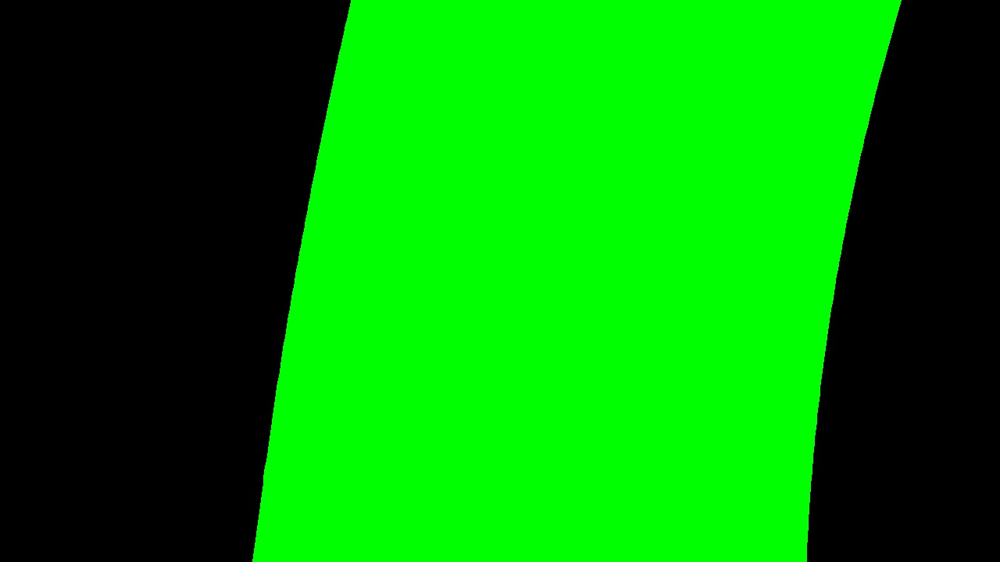

3. Unwarp the previous two images back to the original perspective. This is
implemented using the `cv2.warpPerspective` function, using the `Minv` transformation
matrix instead of `M` (used to get the birds-eye view).

4. Blend the previous unwarped images with the original one, using the
function `cv2.addWeighted`. A value of `alpha = 0.3` has been used to make
the lines and free space area translucid.

5. Display the road curvature and vehicle position using the `cv2.putText` function.

An example result is shown in `main_visualization.jpg`, applied to `test_images/test6.jpg`
(note: dummy road curvature and vehicle position, just for visualization purposes):

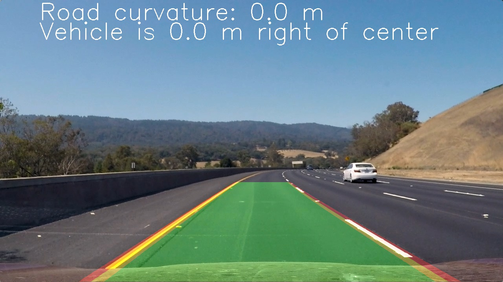

In addition, a debug visualizer has been created that includes the previous
image as well as the relevant intermediate images in the pipeline. It is implemented
in the function `create_debug_img` (`cell #31`).

This is accomplished by simply creating a bigger image and copying the contents of the smaller
images inside. And example is shown in `test6.jpg`:


The main window is the result of the pipeline. On the top-right corner, the color
and gradient masks are shown. On the bottom, we show the warped image, the final
masked image, the selected pixels for line fitting, and the fitted lines (in red),
from left to right.

---

### Pipeline (video images)
<mark>Provide a link to your final video output. Your pipeline should perform reasonably well on the entire project video (wobbly lines are ok but no catastrophic failures that would cause the car to drive off the road!)</mark>

The final video output can be found [here](output_images/project_video.mp4). The lane
markings are robustly detected and tracked throughout the whole video.


### Discussion
<mark>Briefly discuss any problems / issues you faced in your implementation of this project. Where will your pipeline likely fail? What could you do to make it more robust?</mark>

This was indeed a very challenging project, showing us how hard traditional computer
vision is. It was a great learning experience after the Deep Learning projects,
showing us the two main approaches to solving computer vision problems in industry.

The hardest part was selecting and tuning the different color and gradient masks
in order to make a robust algorithm, for example removing shadows.
This was mostly a trial-and-error process, that could be a bit frustrating.

I am very satisfied with the results on the test images and the project video,
however the pipeline performs much worse in the challenge videos, for several reasons:

 - The illumination conditions are slightly different and the color masks don't filter
 all the shadows, or don't pick properly all the white and yellow lines.

 - The road curvature is much smaller (sharper curves).

 - The road was not flat in the harder challenge video. A non-null vehicle pitch
  causes the perspective transform to not work as expected.

In addition, I can think of many other scenarios where the pipeline can fail:

 - Night conditions.
 - Rain conditions.
 - Crowded roads, with vehicle occlusions that don't allow to see the lanemarkings.
 - Sunrise/sunset scenarios, which cast very large shadows.
 - Lane changing situations. After all we assume that the vehicle is relatively
 centered.
 - Many others.
 
After all, we only tested on a very small subset of images, under fairly
favorable conditions. Most likely a more robust method should be implemented, but I really doubt it could cope with the vast variety of situations that can occur.
Even if I managed to have it running on the challenge videos, it does not really
prove that the algorithm would work in any situation. The following **improvements**
should be made to make it more robust:

 - Use masks that do not rely on color, since it's too dependent on illumination conditions.
 - Consider the vehicle pitch when computing perspective transform.
 - Compute the exact position of the horizon in the image, to improve the birds-eye-view.
 - More complex tracking models (e.g. Kalman Filter) for a smoother result.
 - Smarter sanity checks.

Finally, I believe that Deep Learning would have been a much better
approach for this problem (and any CV problem in general). This requires
however a lot of **labelled** data which might not be easily accessible.
There must therefore be a tradeoff between development effort, robustness
and access to labelled data.
