# Vehicle Detection and Tracking
[](http://www.udacity.com/drive)

##Overview

The goals / steps of this project are the following:

* Perform a Histogram of Oriented Gradients (HOG) feature extraction on a labeled training set of images and train a classifier Linear SVM classifier
* Optionally, you can also apply a color transform and append binned color features, as well as histograms of color, to your HOG feature vector. 
* Note: for those first two steps don't forget to normalize your features and randomize a selection for training and testing.
* Implement a sliding-window technique and use your trained classifier to search for vehicles in images.
* Run your pipeline on a video stream and create a heat map of recurring detections frame by frame to reject outliers and follow detected vehicles.
* Estimate a bounding box for vehicles detected.

## Rubric Points
In this write-up, I will address the [rubric](https://review.udacity.com/#!/rubrics/513/view) points. Each question will be <mark>highlighted</mark> for the reader's convenience.
All the references to code and cells are relative to the iPython Notebook
`p5-vehicle-detection.ipynb`. In addition, there will be references to images, which
will be stored in the `output_images` folder.

---

### Writeup / README
<mark>Provide a Writeup / README that includes all the rubric points and how you addressed each one.<mark>

This `README.md` file is the required write-up document that explains the work for this project.

---

### Histogram of Oriented Gradients (HOG)
<mark>Explain how (and identify where in your code) you extracted HOG features from the training images. Explain how you settled on your final choice of HOG parameters.</mark>

The first step in this project was to take a look at the input data. We used the `vehicle`
and `non-vehicle` datasets provided by Udacity, containing 8792 and 9666 64x64 RGB images,
respectively. One example of these images can be seen in `vehicle_non_vehicle.jpg`:

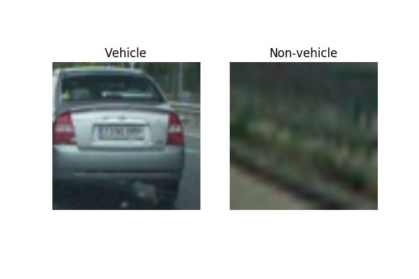

Next, we performed a **preprocessing** step, consisting on color space conversion from
RGB to YCrCb, given the better results shown in the literature with the latter color space.
This operation is performed in `cell #10`, using the function `cv2.cvtColor`.

Finally, we extract HOG features from the YCrCb image in `cell #11`, in the function
`get_hog_features`, using the `hog` function from the `skimage.feature` package. We don't
assume any fixed size for the input image; this way, we can use this function for both
the training images (64x64 pixels) and the test image (1280x720 pixels). Computing
the HOG features on the whole image will save a lot of computation time later.

We extract HOG features for each of the 3 channels (YCrCb), stacking
them together to create a single vector.

We used the following HOG parameters:

 - Pixels per cell: 8
 - Cells per block: 2
 - Number of orientation bins: 9

The **motivation** for choosing these parameters was mostly trial and error to get the
best trade-off between computational complexity and accuracy. We first performed
quick tests on the sandbox in the lecture `32. Search and Classify`.
We tried values within the range that was suggested in the documentation for the `hog` function
as well as the Udacity webpage.

We found that `pixels_per_cell = 16` did a pretty good job at removing false positives,
and made the feature vector much smaller (from 5292 to 972), improving the frame rate.
However some true positives were removed too, so we decided to switch back to 8 pixels
per cells. Another reason for choosing 8 over 16 is that for a 64x64 image
we would only get 4 blocks, which makes it very likely that vehicle is not detected
if it's not well centered in the image.

A little bit of experimentation with `cells_per_block` (range 1-4) and
`number_of_bins` (range 6-12) was also performed, but we didn't find signficant differences in performance. Therefore we used the default values shown in the lectures and documentation, which seemed to perform just fine.

An example result of computing HOG features to an image of class `vehicle` is shown
in `hog_img_vehicle.jpg`:

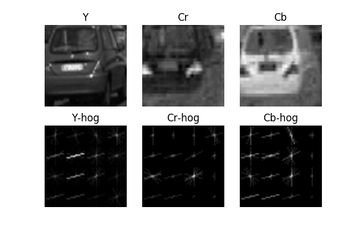

Similarly, for `non-vehicle` we have `hog_img_non_vehicle.jpg`:

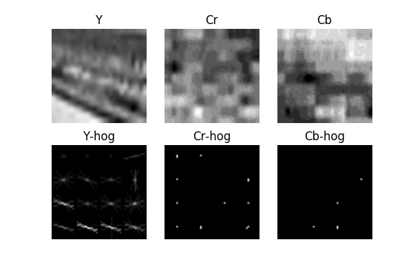

It can be observed that in the `vehicle` class there is a more defined structure,
with multiple horizontal and vertical lines all around the image, mostly for the
`Y` channel both quite a few for the `Cr` and `Cb` channels as well. The gradients
for the `non-vehicle` class seem more unstructured, which will allow us to effectively
classify vehicles in images.

The output of the HOG features is a 7x7x2x2x9x3, or 5292-dimensional vector, which we then
use as input to the classifier.

<mark>Describe how (and identify where in your code) you trained a classifier using your selected HOG features (and color features if you used them).</mark>

Besides HOG features, we also computed spatilly binned and color histogram features,
as can be observed in functions `color_hist_features` (`cell #17`) and `bin_spatial`,
(`cell #18`). Again, some tuning of parameters was performed on the sandbox provided
by Udacity. We use 32 bins per channel for the histograms, and a we resize
the image to 16x16 in the spatial binning, to obtain a small feature vector.

We combine these features into a single 1D vector, of final size 6156, as seen
in function `combine_features`, `cell #19`.

To create the classifier, we opted for a Linear SVM (Support Vector Machine),
given it's tradeoff between powerfulness and computatinal cost, and easy-to-use API
from the `sklearn` kit.

Before using the classifier, we perform **feature normalization** on the HOG
features that we extracted previously. This is implemented in the function
`normalize_features`, `cell #22`. To this extent, we used the `StandardScaler`
object , part of the `sklearn.preprocessing` package, as suggested by Udacity.
According to the documentation, the normalization consists on removing the mean
and scaling to unit variance, which is desirable to make the training procedure
more stable. We `fit` the scaler to the complete training dataset, and then
saved it into the variable `scaler_` for later use when testing on new images.
In other words, we `fit` the normalizer only once.

Next, we **splitted** the data into training and validation sets, with a ratio
of 0.2 for the validation data, using the function `train_test_split`, in
`cell #23`. This function already takes care of **shuffling** the data as well.

The classifier is implemented and trained in `cell #25-28`. The API
is very simple to use: simply the `fit` function will train the classifier
given the training data. We started with the `LinearSVC` classifier, and obtained
99.381% validation accuracy. Then we moved into the non-linear `SVC`, with default
`rbf` kernel, which made it more powerful obtaining 99.7% validation accuracy. However
it turned out to be extremely slow (around 10 seconds per frame) so we decided
to use the `LinearSVC` plus some extra techniques to remove false positives.

Finally, we verify the classifier on some test image using the function
`classify_img`, in `cell #31`. The result can be observed in `svm_test.jpg`:

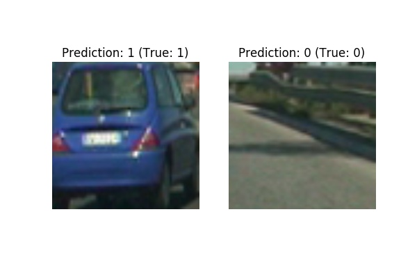

It can be observed that the classifier is able to correctly classify the images
as `vehicle` and `non-vehicle`.

---
### Sliding Window Search
<mark>Describe how (and identify where in your code) you implemented a sliding window search. How did you decide what scales to search and how much to overlap windows?</mark>

In order to detect vehicles in the complete image, we implement a sliding window
approach. First, we implement a `SearchWindow` class, (see `cell #13`), that
helps us extract the contents of an image It also allows us
to **obtain the HOG features** from the pre-computed features on the whole
image, see function `SearchWindow::get_hog_features`. This is accomplished
by extracting the HOG features as an array instead of a vector. Thanks to this,
we **only need to compute the HOG features once per image and scale**, which
improves the frame rate.

Second, we implement a function that takes an image and returns a list of
windows in which we should search for vehicles: function `get_search_windows`,
in `cell #33`, with the following properties:

 - **Window size**: 64x64, to match the HOG implementation and training data.
 - **Overlap**: 0.75. We tried a smaller overlap of 0.5, but the performance decreased
 quite dramatically, with a lot of false negatives.
 - **Region of interest**: bottom half of the image, so we don't search above
 the horizon.

An example of the search windows of size 64x64 can be seen in `search_boxes.jpg`:

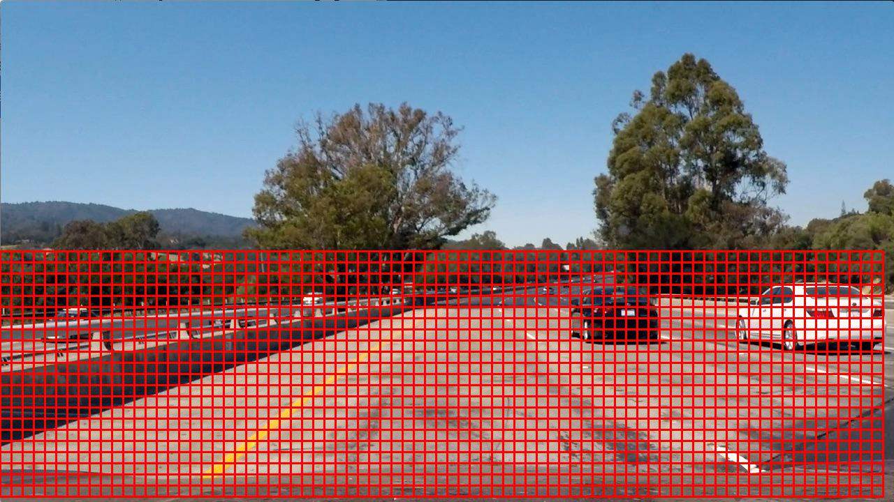

**Multi-scale search**

In order to search on different scales, we use the same function
`get_search_windows`, but we **resize the image first**. In particular, we
search at scales 1.0, 0.75 and 0.5, which is equivalent to window sizes
of size 64x64, 96x96 and 128x128, respectively. We also tried windows
of size 256x256 but turned out to be too big and returned quite many false positives.
This scaling operation is done later on in the `SingleImagePipeline`, see
`cell #39`, with the function `cv2.resize`.

**Motivation for parameters**

The choice of overlapping and number of scales was always a trade-off between
number of windows (and therefore computational cost) and accuracy. 
The larger number of windows, the more computationaltime. However a small overlapping,
like 0.5, would cause windows to never have a vehicle somewhat centered, so the number of false negatives would increase.

The final choice is essentially the result of trial and error, using reasonable
values to obtain approximately 2000 search windows over the 3 different scales.

<mark>Show some examples of test images to demonstrate how your pipeline is working. How did you optimize the performance of your classifier?</mark>

The complete pipeline is applied to the given test images, `test1.jpg` through
`test6.jpg`, as can be seen in the folder `output_images`, shown below:

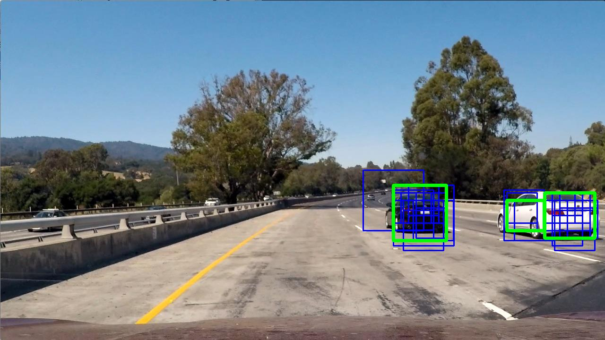 test1.jpg
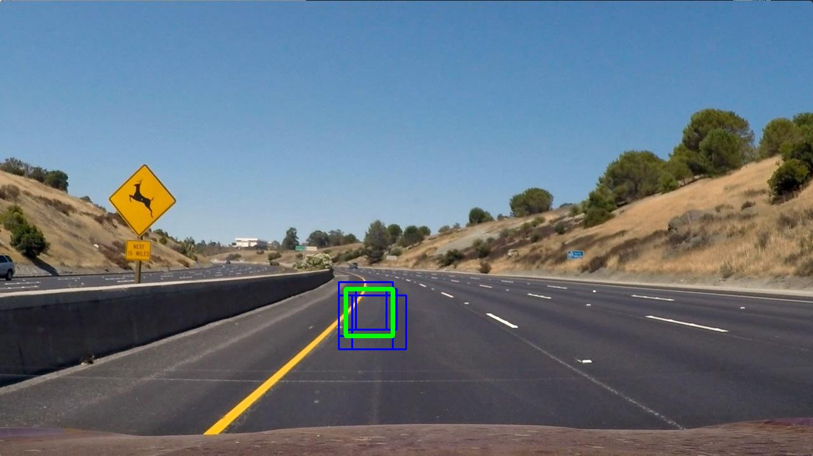 test2.jpg
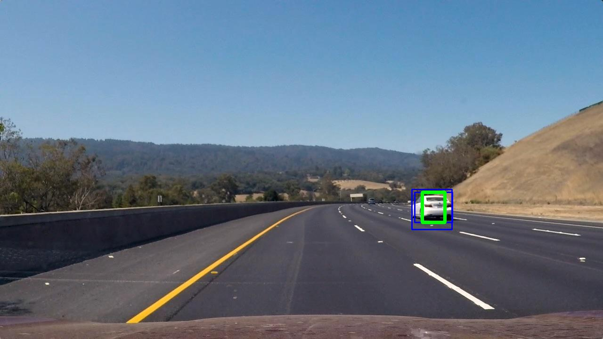 test3.jpg
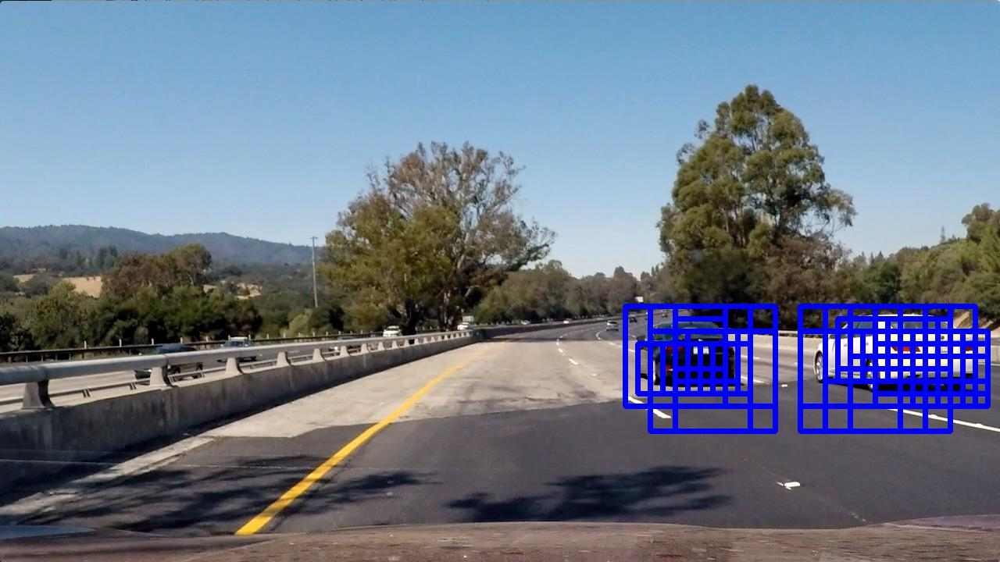 test4.jpg
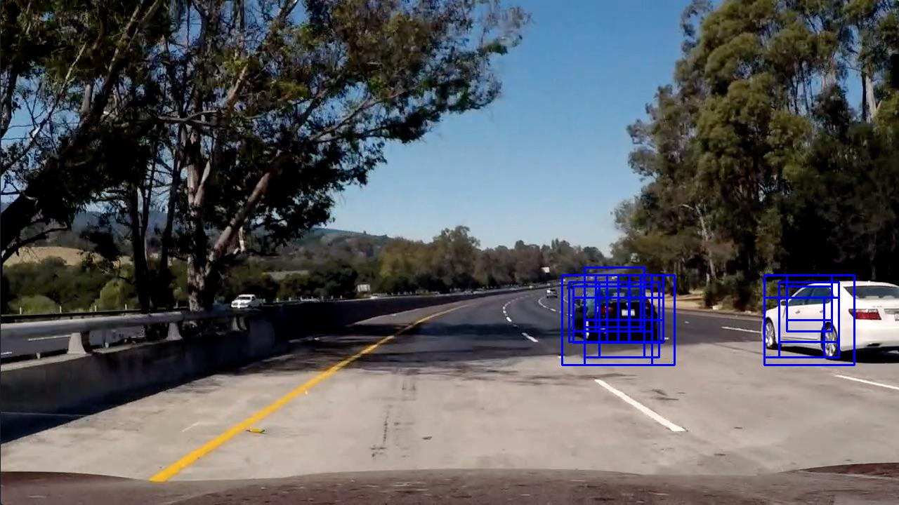 test5.jpg
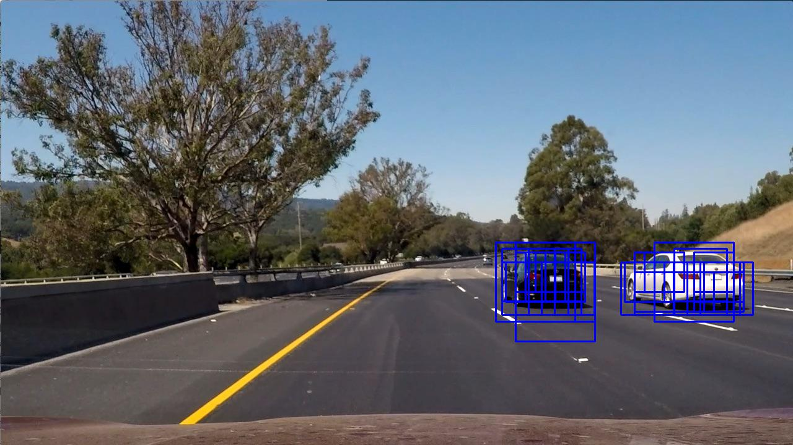 test6.jpg


It can be seen that all the vehicles are detected reliably with many windows at different
scales, which will provide good results in the video afterwards. We observe **only
one false positive**, in `test5.jpg`, probably due to the presence of shadows. We
will filter it out when performing video processing. It's also important to notice
that no vehicles are detected at all in `test2.jpg`, as it's supposed to be.

**Optimizing the performance of the classifier**

To optimize the performance of the classifier was a really tough trial and error work. The following was considered during the process of tuning the classifier:

 - **Choice of the feature vector**. This is very related to the question regarding
 the parameters of the HOG classifier. We noticed that having a bigger feature vector
 improved the robustness of the classifier, at the cost of lower the computational speed.
 For this reason, the feature vector is 5292-dimensional instead of 972-dimensional
 (8 pixels per cell vs 16 pixels per cell). In addition, we also observed that
 **the performance increased dramatically by adding spatial and histogram features**
 to the HOG vector (which we tried alone initially). The computational cost didn't increase
 much, but a lot of false positives were removed.

 - **Tuning of the `C` parameter the SVM classifier**. This parameters decides how
 misclassification is penalized. A large value would make the classifier very strict and
 potentially overfit the data. A too low value would make it more flexible, but at the
 risk of having a large classification error. The default value was 1.0 and we
 experimented with values from 10.0 all the way down to 0.0001. The best value
 was 0.001, which very effectively helped removing false positives while keeping
 the true positives. Some of them still remained though.

 - **Thresholding on the decision function**. Instead of using the `predict`
 function of the  classifier, we used the `decision_function` function,
 which provides the signed distance to the hyperplane for each prediction.
 This can be observed in the function `predict`, `cell #10`:
 
 ```python
 def predict(x):
    v = classifier_.decision_function(x)
    v_threshold = 0.1
    
    if v > v_threshold:
        return get_vehicle_label()
    else:
        return get_non_vehicle_label()
```
   We managed to remove some additional false positives by increasing the value
   `v_threshold` to 0.1.


 - **Use data augmentation**. We implemented data augmentation in `cell #9`, by applying
 random shifts to the images. This improved the cross-validation accuracy and mostly
 helped detecting vehicles more reliably, while removing some of the false positives
 we used to have.

---
### Video Implementation
<mark>Provide a link to your final video output. Your pipeline should perform reasonably well on the entire project video (somewhat wobbly or unstable bounding boxes are ok as long as you are identifying the vehicles most of the time with minimal false positives.)</mark>

The video output can be found [here](./output_images/project_video.mp4).

The vehicles are detected most of the time although the bounding boxes are a bit unstable.
Sometimes the white car is not tracked for a few frames especially at far distances. The main
reason is the filtering done to remove false positives.

<mark>Describe how (and identify where in your code) you implemented some kind of filter for false positives and some method for combining overlapping bounding boxes.</mark>

In order to combine overlapping bounding boxes and remove false positives, we
implemented a solution based on a **heatmap**.

A heatmap is basically a 2D array of the same size of the image.
For each window with a positive detection, we increase the value of the pixels
in the heatmap corresponding to that window. This is done in the function
`add_heat`, see `cell #38`. An example can be seen in the following pictures,
`test4_heatmap.jpg` and `test4_heatmap.jpg`.

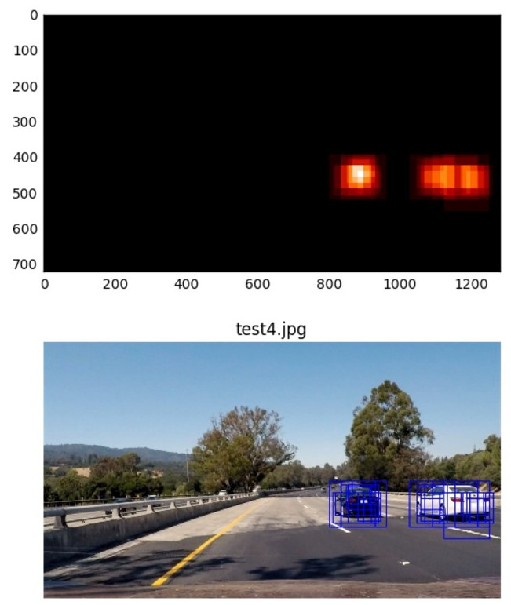 test4_heatmap.jpg

In `test4_heatmap.jpg`, we observe how overlapping boxes get combined into
two distintive blobs.

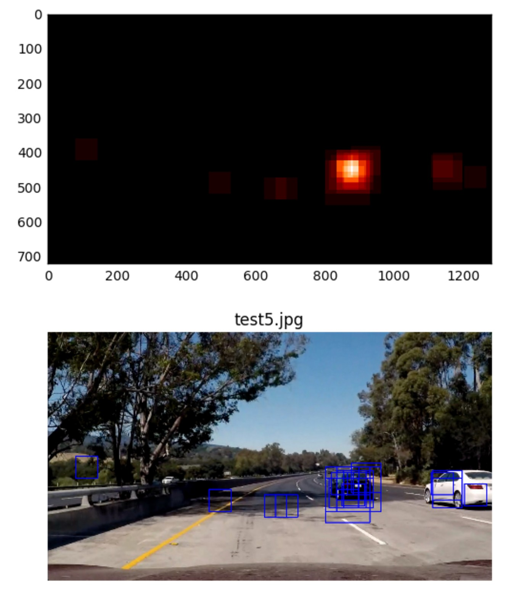 test5_heatmap.jpg

In the `test5_heatmap.jpg`, we notice how the false positive is insignificant
compared to the main car detections, so we can filter them out later by thresholding
the heatmap.

In the `VideoPipeline` class, we store an **array of heatmaps**, in order to
perform a **moving average**. This can be observed in `cell #42`:

```python
# Detect vehicles in single image
heatmap_id = self.frame_counter % self.N_HEATMAP_AVG
self.heatmaps[:, :, heatmap_id] = self.single_img_pipeline.run(img)

# Average heatmap over frames
heatmap_avg = np.mean(self.heatmaps, axis = 2).astype(np.uint8)
```

This makes smooths out the bounding boxes.

Last, we compute the final bounding box from the averaged heatmap using
the function `extract_boxes_from_heatmap`, see `cell #38`. This function
has two steps:

 1. Use the function `cv2.findContours` to find the pixels that belong
 to clusters in the heatmap, based on the Connected Components algorithm.
 2. Use the function `cv2.boundingRect` to extract the bounding box that
 corresponds to those pixels.

The result is the bounding box that we display in the output image, one per
vehicle, with all (or at least most of them) the false positives removed.

---
### Discussion
<mark>Briefly discuss any problems / issues you faced in your implementation of
this project. Where will your pipeline likely fail?
What could you do to make it more robust?</mark>

This project was really challenging. We followed a traditional Computer Vision
approach, which was great from a learning experience in order to better
appreciate more modern approaches, like Deep Learning. The following factors
made the project harder than the previous CV projects:

 - **Computational time**, main limiting factor in this project. It was very hard
 to trade off frame rate and accuracy. This mainly due to the **sliding window**
 approach: we have to search in too many images, which raises the computational
 time. A much better approach for this project would have been Deep Learning,
 with networks like YOLO (You Only Look Once) or SSD (Single Shot Detector).

 - **Parameter tuning**. As all traditional Computer Vision approaches, there were
 just too many paramters to tune: HOG parameters, number of search windows, overlap,
 number of scales, heatmap update and cooldown, etc.

 - **Time constraints**. We only had 2 weeks to work on this project, which in my
 opinion was way too little time. I would have liked to have more time to try out
 Deep Learning approaches to this problem.


Regarding the pipeline, we can see some points where it could be improved:

 - **Framerate**. This pipeline can obviously not run in real time (around 2.6 sec/frame),
 so it's a bit weak point that should be improved. In my opinion, sliding window approaches
 cannot be applied to real-time systems because they just take too much time,
 no matter which classifier is used. As said before, a YOLO or SSD network
 would provide a much better performance from a computational point of view.

 - **Vehicle tracking**. The vehicle tracking would be smoother if more advanced
 techniques such as the Kalman Filter were used.

 - **Smaller scales**. The classifier is not very good at detecting vehicles at far
 distances. Therefore it would be desirable to use a smaller scale (maybe a 32x32)
 window. This would however increase the computation time quite dramatically,
 given the high number of additional search windows to test. It should then be
 applied only to a very limited region of the image, around the horizon.

 - **Front vehicle tracking**. We observe in the video that oncoming vehicles
 in the adjacent lane are not detected at all. This is due to the fact that the
 training data only had images of vehicles as seen from behind. Extending
 the dataset with front-view vehicles would allow us to classify oncoming
 vehicles as well.
