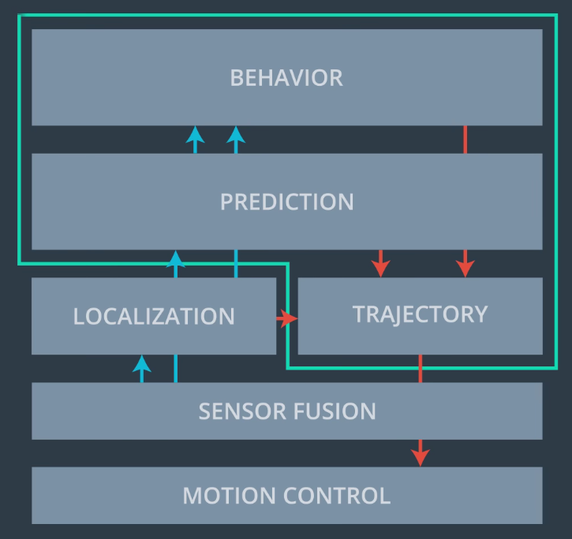
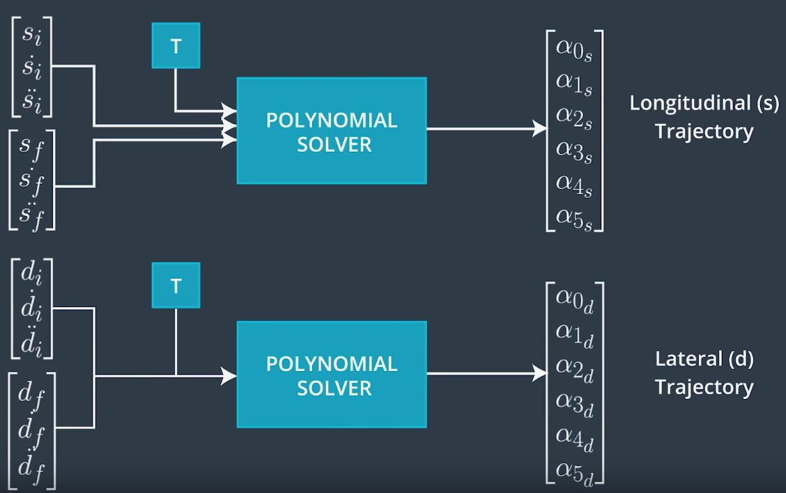
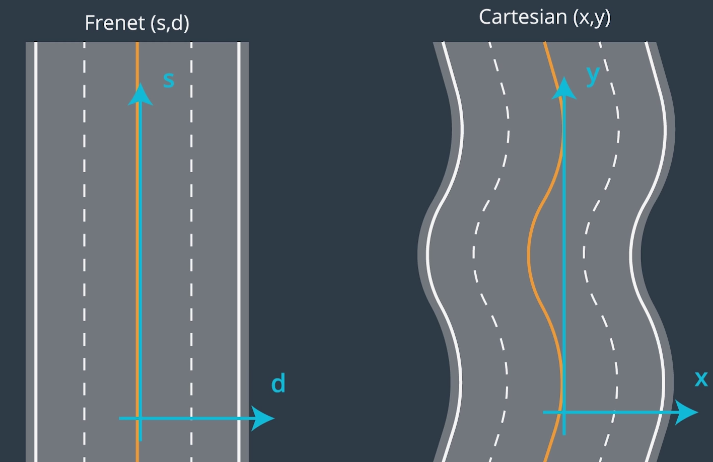
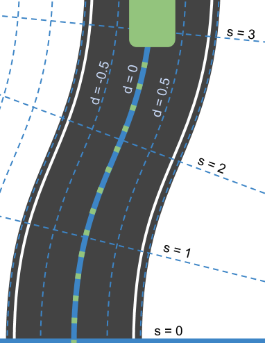
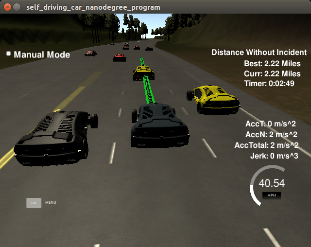

Model Documentation
===================

This document explains the code model for generating paths in detail.

Introduction
------------
The main goal for this project is to generate a trajectory
(given in (x,y) Cartesian map coordinates) that is sent to a simulator,
which will make the vehicle perfectly follow the points (perfect controller).
All with the aim of driving around a circuit while staying in lane, avoiding collisions
and passing slow traffic.

Global Overview
---------------

The project has been divided into several modules to accomplish the functionality.
The figure below, by Udacity, summarizes very well the implemented components,
in the green box:



- The input to our system is:
  - Localization: where in the map our vehicle is.
  - Sensor Fusion: where in the map other vehicles are.
  - Map: where do we want to go next.

1. The **Behavior** module takes this information and decides, at a high level,
 what action should the vehicle take. For example: go straight or turn left.

2. The **Trajectory** module executes the action received from the Behavior
 module, outputting a list of waypoints representing a safe trajectory
 for the vehicle to follow.

Even though it's not used in this project, it's worth mentioning that
the trajectory can be further optimized by using the **Prediction** module,
predicting where other vehicles will be in the future.

In the following sections, we explain how the Behavior and Trajectory
generation modules are implemented.

Main Code Classes
-----------------

The main C++ classes that implement the previous modules are:

- `PathPlanner`, in `include/path_planner.h`. This class encapsulates the complete
 path planner (green box above). It contains the behavior and trajectory modules.

- `BehaviorPlanner`, in `include/behavior_planner.h`. This class implements
 the Behavior module, taking as input all sensor and ego-vehicle data, the map,
 and outputing a `CarBehavior` action.

- `TrajectoryGenerator`, in `include/trajectory_generator.h`. This class
 takes as input the `CarBehavior` action from the Behavior module
 and generates a list of waypoints in (X,Y) map coordinates to send
 to the simulator.

We will describe these classes in detail in the following sections.

Additionally, the files `src/map.cpp` and `src/utils.cpp` contain
several utility functions used throughout the project.

Behavior Planning
-----------------

The code for planning the next action the car should take is in the
`BehaviorPlanning::getNextAction` class:

```
/// \brief Determines the next action to take
/// \param ego_vehicle ego-vehicle data
/// \param sensor_fusion sensor fusion data
/// \return the next action to take
CarBehavior getNextAction(const EgoVehicleData& ego_vehicle,
                          const SensorFusionData& sensor_fusion);
```

where `CarBehavior` is an `enum`:

```cpp
/// \brief Enum defining which behaviour the car should follow
enum class CarBehavior
{
    GO_STRAIGHT,          ///< Continue in the same lane, adjusting speed as necessary
    CHANGE_LANE_LEFT,     ///< Initiate change left
    CHANGE_LANE_RIGHT,    ///< Initiate change right
    COMPLETE_LANE_CHANGE  ///< Continue lane change maneuver until finished
};
```

### Vehicle states

The possible vehicle states are:

- **Go straight**. The vehicle remains in its current lane.
- **Change lane**. The vehicle changes lane, to left or right.
- **Complete change lane**. This additional state ensures that we don't
 attempt a new lane change until we have successfully finished one. This
 ensure that the lateral acceleration and jerk are within limits.

### Code overview

The code implementing `getNextAction` can be found in `src/behavior_planner.cpp:14-83`,
summarized as follows:

- First, check if we are changing lane. If so, continue in that state
 until the vehicle is almost in the center of the lane.

- Otherwise, compute the cost for each lane.
- Select the lane with smallest cost. If it's the current lane, then
 continue straight; otherwise, trigger a lane change.

### Lane cost computation

The cost for each lane is computed in `BehaviorPlanner::computeLaneCost`,
in `src/behavior_planner.cpp:85-156`, considering the following factors:

- **Velocity of the closest vehicle ahead**. We call this the `lane velocity`. 
 The smaller the lane velocity, the smaller the cost.

- **Gap to vehicle in front**. The farther away we are from other vehicles, the better.
- **Maneuverability**. Being in the center lane gives us more options to maneuver
 than if we are in the side lanes.

We combine these factors into a score function, and then take the inverse to
output a cost.

Trajectory Generation
---------------------

The `TrajectoryGeneration` class generates the trajectory that the vehicle
should follow, given the desired action returned from the
`BehaviorPlanner`. The following steps are taken:

1. Copy the first points of the trajectory sent in the previous timestep
 to the new one, to ensure that the trajectory is smooth:

  ```cpp
  // Copy part of the previous trajectory to the output
  for (std::size_t i = 0U; i < n_points_keep; ++i)
  {
      out_x.push_back(previous_x[i]);
      out_y.push_back(previous_y[i]);
  }
  ```

2. Generate the future (s, s_dot, s_ddot, d, d_dot, d_ddot) state, stored in
the `EgoVehicleFrenet` class, depending on the next action:

 - If the action is to go straight, then we analyze the other vehicles
 to see if there is any in front of us. If so, we perform target tracking
 (see Collision Avoidance - Target Tracking section below)
 to stay close to it but avoiding collision; otherwise we keep
 at the maximum allowed speed. The destination `d` is the same as the current.

 - If the action is to change lane, then we modify the `d` coordinate accordingly:

   ```cpp
    else if (next_action == CarBehavior::CHANGE_LANE_LEFT)
    {
        next_state.d = std::max(2.0, (Map::getLaneNumber(ego_vehicle_frenet.d) - 0.5) * kLaneWidth);
        target_d_for_lane_change_ = next_state.d;
    }
    else if (next_action == CarBehavior::CHANGE_LANE_RIGHT)
    {
        next_state.d = std::min(10.0, (Map::getLaneNumber(ego_vehicle_frenet.d) + 1.5) * kLaneWidth);
        target_d_for_lane_change_ = next_state.d;
    }
```

3. Generate the trajectory in (s,d) coordinates. For this we use two
 Jerk-Minimizing Trajectory (JMT) generators, as seen in the lectures
(the implementation is omitted since it's the same as in the lectures):



  - For **longitudinal control**, we use a 2nd-order polynomial
  and the target state consists on **only the final velocity**. The motivation is:

    - It was very hard to estimate the boundary conditions for `s`.
    - Sometimes the generated trajectory would make `s` go forward and backward,
    which is not admissible. A 2nd-order polynomial guaranteed a strictly increasing `s`.
    - This model represents **constant acceleration**, so we can enforce a maximum accelaration
    easily.

  - For **lateral control**, we used a 5th-order polynomial just like in the lectures,
    since the end state is very clear: `(d_lane, s_dot = 0, s_ddot = 0)`.

4. Convert from Frenet (s,d) to Cartesian (x,y) map coordinates to send to the
 simulator. Please see Frenet to Cartesian Conversion below for more details.


Coordinate Systems
------------------
The first question that we asked ourselves in the project is:
**which coordinate system to use**? We analyzed two main options, as shown
in the following figure:



- **Cartesian coordinates**. They represent directly the position of the vehicle
 in the world. The main advantage is that the simulator performs its analysis
 based on these coordinates. For example, if we compute a trajectory
 in Cartesian coordinates and we analytically can prove that the speed is below
 the limit, it will for sure be in the simulator.

 The main disadvantage, as shown in the picture, is that is not as convenient
 to work with - we need to constantly take into account the road shape.

- **Frenet coordinates**. Frenet coordinates are very convenient to work
 with because they eliminate any information about the shape of the road.
 Instead, we only work with longitudinal position (`s`) and lateral position
 (`d`), perpendicular to the direction of the road, as shown below:



 The main disadvantage, however, is that we need to transform back to Cartesian
 coordinates to feed the simulator, and this always involves a small
 **conversion error**, since there's a **non-linear transformation involved**.

 For example, if we plan our trajectory to have a certain speed in the `s` direction
 (`s_dot`), we **cannot ensure that speed will be the same in the simulator**.


After some considerations, **we choose to use Frenet coordinates for this project**,
given its simplicity, enough accuracy and **clean and intuitive code** associated to it.


Frenet to Cartesian Conversion and Trajectory Smoothing
-------------------------------------------------------

When we first started the project, we realized that the provided `FrenetToXY`
conversion function was not very accurate, and generated sharp, non smooth
trajectories that violated the acceleration and jerk limits.

Therefore we decided to create our **own conversion function**, that would,
in addition, **smooth out the trajectory**.

This function is implemented as part of the `Map` class, in
`src/map.cpp:58-73`.

- We make intensive use of the `spline.h` utility class, pointed out by Udacity.
- The `Map` class contains 4 splines:
  - `spline_x_`: `x` in map coordinates, as a function of `s`.
  - `spline_y_`: `y` in map coordinates, as a function of `s`.
  - `spline_dx_`: `dx` in map coordinates, as a function of `s`.
  - `spline_dy_`: `dy` in map coordinates, as a function of `s`.

- These splines are fitted to the points in the `Map` constructor, after reading
the raw data from the CSV:

```cpp
Map::Map(const MapData &raw_data) :
    raw_data_(raw_data),
    spline_x_(),
    spline_y_(),
    spline_dx_(),
    spline_dy_()
{
    // Push an extra point at s = max_s, to ensure continuity
    raw_data_.s.push_back(kMaxS);
    raw_data_.x.push_back(raw_data_.x[0U]);
    raw_data_.y.push_back(raw_data_.y[0U]);
    raw_data_.dx.push_back(raw_data_.dx[0U]);
    raw_data_.dy.push_back(raw_data_.dy[0U]);

    // Compute splines
    spline_x_.set_points(raw_data_.s, raw_data_.x);
    spline_y_.set_points(raw_data_.s, raw_data_.y);
    spline_dx_.set_points(raw_data_.s, raw_data_.dx);
    spline_dy_.set_points(raw_data_.s, raw_data_.dy);
}
```

The `frenetToXy` function is implemented as follows:

```cpp
std::pair<double, double> Map::frenetToXy(const double s, const double d) const
{
    // Compute (x,y) position in the center of the road
    const double x_center = spline_x_(s);
    const double y_center = spline_y_(s);

    // Get d vector
    const double dx = spline_dx_(s);
    const double dy = spline_dy_(s);

    // Compute final position adding offset in the d direction
    const double x_out = x_center + d * dx;
    const double y_out = y_center + d * dy;

    return {x_out, y_out};
}
```

1. Get the (x,y) position of the center of the road for a given `s`.
2. Get the normal vector (dx, dy) for that position.
3. Compute the final (x,y) by adding the center to a scaled version
of the normal vector.

As can be seen, it's a very neat way of converting between coordinates,
and it provides very accurate and smooth results, as seen in the
demostration video.

Keeping the Speed Limit
-----------------------

In our implementation, we had to be **conservative**, making the vehicle
drive slightly slower than the speed limit to ensure it is never reached.

The main reason for this is that we generate our trajectory in Frenet
coordinates, and therefore we set limits to `s_dot`. However, the final
trajectory is converted to Cartesian XY coordinates. Since the conversion
is a non-linear transformation, some errors occur and the forward velocity
of the vehicle is not the same as `s_dot`. In other words,
we **cannot accurately estimate the real velocity of the vehicle in Frenet coordinates**.

This happened especially in the right-most lane, where the non-linear
transform has a greater effect. 

To overcome this problem, we first set a quite conservative speed limit of
45 mph. However this turned out to be rather slow for the left and center lanes.
Therefore we opted for a solution consisting on **per-lane speed limits**,
as can be seen in `src/trajectory_generator.cpp:44`:

    const std::vector<double> kTargetLaneSpeed = {mph2ms(48.5), mph2ms(47.0), mph2ms(46.0)};  // [m/s]

This was enough to keep a decent maximum speed approaching 49 mph all lanes,
therefore staying under the speed limit.

This limit is passed to the trajectory generator as the `next_state.s_dot` value,
to ensure that's the maximum speed at all times, as seen in
`src/trajectory_generator.cpp:127`:

```cpp
// The final target speed is the minimum between the speed limit for the lane
// and the previously chosen target speed
next_state.s_dot = std::min(next_state.s_dot, kTargetLaneSpeed[Map::getLaneNumber(next_state.d)]);
```

Keeping Acceleration and Jerk Limits
-------------------------------------

- The maximum acceleration is defined in `include/trajectory_generator.h:37`:

      const double kMaxAcceleration = 9.5;  // [m/s^2]

  And used to compute the maximum target velocity that the generator should aim for,
  in `src/trajectory_generator.cpp:215`:

      const double v_max = ego_vehicle_data.s_dot + kMaxAcceleration * t_new_trajectory;

- In addition we ensure that we produce **Jerk-Minimizing Trajectories** (JMT) with
  5 or less-order polynomials or.

- Finally, we evaluated curves of acceleration and jerk for different target
  trajectories and empirically came to the conclusion that a **trajectory duration**
  of `T = 2 seconds` was enough to keep the values of acceleration and jerk
  under the desired boundaries. This constant is defined in
  `include/trajectory_generation.h:19`:

      const double kTrajectoryDuration = 2.0;


Collision Avoidance
-------------------

Two main methods have been implemented to ensure the ego-vehicle
does not collide with other vehicles:

- **Target tracking**. This is the case where the ego-vehicle ends up behind
  another vehicle, but cannot change lane for some reason. In this case,
  the strategy is to progressively reduce the speed to match the following
  vehicle's speed, and set some safety distance in front.
  This is implemented in `src/trajectory_generator.cpp:78`:

```cpp
// Set target velocity to match the one of the vehicle in front
const int ego_lane = Map::getLaneNumber(ego_vehicle_frenet.d);

double min_gap = std::numeric_limits<double>::max();
for (const VehicleData& vehicle : sensor_fusion.vehicles)
{
    const int vehicle_lane = Map::getLaneNumber(vehicle.d);

    if (vehicle_lane == ego_lane)
    {
        const double gap = Map::s_min_diff(vehicle.s, ego_vehicle_frenet.s);

        //
        if ((gap > 0) && (gap < kTargetTrackingMaxGap) && (gap < min_gap))
        {
            min_gap = gap;
            const double v = std::sqrt(vehicle.vx * vehicle.vx +
                                       vehicle.vy * vehicle.vy);

            if (gap < kTargetTrackingMinGap)
            {
                // Slow down a bit if we are too close
                next_state.s_dot = 0.9 * v;
            }
            else if (gap
            {
                next_state.s_dot = v;
            }
        }
    }
}
```

  In sum, we analyze the whole list of vehicles and take the closest one
  in front of us. We reduce the speed to match its speed if our distance
  to it is smaller than `kTargetTrackingMaxGap`. Due to errors
  in estimating velocity, we introduce a minimum gap `kTargetTrackingMinGap` that,
  if reached, makes our vehicle go slowler than the target vehicle. 

- **Gap tracking**. Before performing a lane change, we analyze if there is
 a large enough gap in it for our vehicle to fit in. This is implemented
 while calculating the cost for each lane in the `BehaviorPlanner` class,
 see in `src/behaviorplanner.cpp:143`:

```cpp
// Infinite cost if we try to change lane but there's no gap for us
// to move into
if (ego_lane != lane_number)
{
    if (gap_vehicle_back  < kMinVehicleGapBack ||
        gap_vehicle_front < kMinVehicleGapFront)
    {
        score = std::numeric_limits<double>::min();
    }
}
```

 The gaps to front and back vehicles are implemented in a very similar fashion
 as for the target tracking problem. As it can be seen, if any of the gaps
 is smaller than a threshold, the score for the lane is set to a very
 small number, and therefore the cost will be almost infinite. Then, the best
 action will be to either change to other lane if possible or remain in the
 current one.

 The following picture illustrates a situation where the ego-vehicle cannot
 change lanes because they are occupied, so it keeps tracking the vehicle in
 front at a lower speed until one of the lane becomes free:

 

Keeping the Vehicle in the Lane
-------------------------------

The implementation is rather simple: always try to make the vehicle
drive towards the center of the lane. In other words, we **always** set
the `d` value of the `target` position to be the center of the target lane.

This is implemented in `src/trajectory_generator.cpp:110`

```cpp
next_state.d = (Map::getLaneNumber(ego_vehicle_frenet.d) + 0.5) * kLaneWidth;
```

As can be seen, `next_state.d` is always 0.5 times `kLaneWidth`, effectively
positioning the vehicle in the center of the lane. The previous code
applies to the center lane but a similar approach is implemented for the other lanes.


Lane Changing
-------------

The lane change is triggered when the `CarBehavior::CHANGE_LANE_LEFT` or
`CarBehavior::CHANGE_LANE_RIGHT` action occurs, which can happen if the
cost for the corresponding lane is smaller than the one for the ego lane.

The trajectory is effectively implemented by simply modifying the
target `next_state.d` value in `src/trajectory_generator.cpp`, as shown
in the previous code snippet:

```cpp
else if (next_action == CarBehavior::CHANGE_LANE_LEFT)
{
    next_state.d = std::max(2.0, (Map::getLaneNumber(ego_vehicle_frenet.d) - 0.5) * kLaneWidth);
    target_d_for_lane_change_ = next_state.d;
}
else if (next_action == CarBehavior::CHANGE_LANE_RIGHT)
{
    next_state.d = std::min(10.0, (Map::getLaneNumber(ego_vehicle_frenet.d) + 1.5) * kLaneWidth);
    target_d_for_lane_change_ = next_state.d;
}
```

We introduce an extra check to ensure the next position doesn't go below 2.0 meters
(center of left lane) or 10.0 meters (center of right lane).

Then the trajectory generator is in charge of generating a smooth trajectory
fulfilling that target state.

Final Reflection and Limitations
--------------------------------

This project has by far been one of the most challenging, for several reasons:

- Full flexibility when writing code - all approaches are valid as long as they pass
specifications!

- Spent extra time understanding and reverse-engineering the simulator.

- Hard to reproduce bugs/errors, since every time the simulator starts with a
random configuration. A good failure logging system would have been benefitial.

- Hard to choose for Frenet or Cartesian coordinates; both have their pros and cons.

### Limitations

The submitted code has some known limitations, which would be addressed given
more time to complete the project:

- **No vehicle prediction is performed**. We currently do not take into account the future
motion of other vehicles, which can make some trajectories unsafe. Our trajectories
are safe at the cost of being extra conservative, by including large safety gaps
before changing lanes.

- **Vehicle can get stuck behind slow traffic until the next lane is free**,
since the default behavior is to follow the vehicle in front until a lane is free.
It would be smarter to maybe slow down a bit to track a vehicle behind us and change lane.

- **Inaccuracies in Frenet to XY conversion** result in too conservative
target velocity, below the road speed limit.
