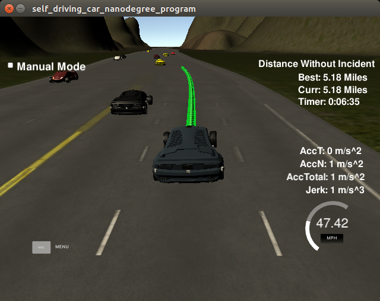
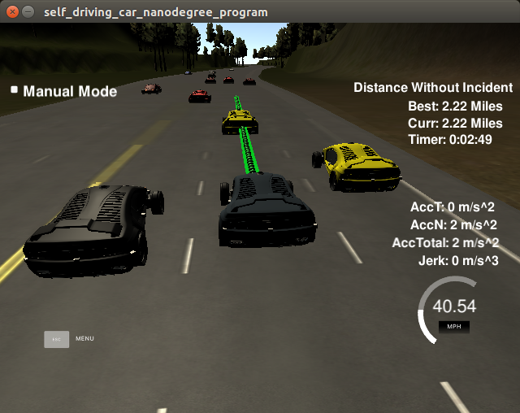

Self-Driving Car Nanodegree - Path Planning Project
====================================================================

In this document we describe the implementation of the Path Planning project for the course,
following the questions from the [rubric](https://review.udacity.com/#!/projects/318/rubric).

Demonstration video
===================

Watch [here](path_planning_final.mkv).


Dockerfile
==========
Before describing the implementation, it's worth noting the following scripts:

- `build.sh`. It will build the project using a Docker image containing
the required dependencies. Please run it from command line as:

      $ ./build.sh

- `run.sh`. It will run the project from `build/path_planning`.
Please run it from command line as:

      $ ./run.sh

This should allow reviewers to be able to build and run the project
even if they don't have the dependencies installed.
Otherwise, standard `cmake/make` build steps are possible given that
the required dependencies are available.

Rubric questions
================
Now we proceed to answer the questions from the rubric.

Compilation
===========

1. The code compiles correctly
------------------------------
The code compiles without any errors or warnings on:

- Ubuntu 16.04
- G++ 5.4.0
- CMake 3.5.1

By running the following:

    mkdir build
    cd build
    cmake ..
    make

To run the code, please follow:

    cd build
    ./path_planning

Valid Trajectories
==================

1. The car is able to drive at least 4.32 miles without incident.
----------------------------------------------------------------

This can be observed in the video and in the following picture:


Indeed, the vehicle has traveled 5.18 miles, and one lap is 4.32 miles.

In order to accomplish this, obviously a good trajectory generator is required
to avoid other cars and stay in lane (explained in detail in the
[model documentation](Model Documentation.md)).

However, two additional aspects are key to accomplish the task of
going from Lap 1 to Lap 2:

- Wrapping the `s` Frenet coordinate around the maximum `s`. This is performed
in `src/trajectory_generator.cpp:231`:

    const double s = std::fmod(evaluatePolynomial(coeffs_s, t), kMaxS);

note that we take the modulus of the target `s` with respect `kMaxS`.

- Computing differences in `s` coordinates must be taken care of
in a special way, just the way we do we angles. This is implemented
in `include/map.h`:

```cpp
static double s_min_diff(double s_a, double s_b)
{
    double output = s_a - s_b;

    if (output < -0.5 * kMaxS)
    {
        output += kMaxS;
    }
    else if (output > 0.5 * kMaxS)
    {
        output -= kMaxS;
    }

    return output;
}
```

This function ensures that the difference between `s_a` and `s_b` will
always be the shortest distance, an can be signed.

2. The car drives according to the speed limit.
-----------------------------------------------

Given that we managed to complete one lap without incidents, we prove that
the vehicle drives according to the speed limit.

In our implementation, we had to be **conservative**, making the vehicle
drive slightly slower than the speed limit to ensure it is never reached.

The main reason for this is that we generate our trajectory in Frenet
coordinates, and therefore we set limits to `s_dot`. However, the final
trajectory is converted to Cartesian XY coordinates. Since the conversion
is a non-linear transformation, some errors occur and the forward velocity
of the vehicle is not the same as `s_dot`. In other words,
we **cannot accurately estimate the real velocity of the vehicle in Frenet coordinates**.

This happened especially in the right-most lane, where the non-linear
transform has a greater effect. 

To overcome this problem, we first set a quite conservative speed limit of
45 mph. However this turned out to be rather slow for the left and center lanes.
Therefore we opted for a solution consisting on **per-lane speed limits**,
as can be seen in `src/trajectory_generator.cpp:44`:

    const std::vector<double> kTargetLaneSpeed = {mph2ms(48.5), mph2ms(47.0), mph2ms(46.0)};  // [m/s]

This was enough to keep a decent maximum speed approaching 49 mph all lanes,
therefore staying under the speed limit.

This limit is passed to the trajectory generator as the `next_state.s_dot` value,
to ensure that's the maximum speed at all times, as seen in
`src/trajectory_generator.cpp:127`:

```cpp
// The final target speed is the minimum between the speed limit for the lane
// and the previously chosen target speed
next_state.s_dot = std::min(next_state.s_dot, kTargetLaneSpeed[Map::getLaneNumber(next_state.d)]);
```

3. Max Acceleration and Jerk are not exceeded.
----------------------------------------------

As before, we drive one lap without any issues, meaning that we also fulfill the
acceleration and jerk requirements.

- The maximum acceleration is defined in `include/trajectory_generator.h:37`:

      const double kMaxAcceleration = 9.5;  // [m/s^2]

  And used to compute the maximum target velocity that the generator should aim for,
  in `src/trajectory_generator.cpp:215`:

      const double v_max = ego_vehicle_data.s_dot + kMaxAcceleration * t_new_trajectory;

- In addition we ensure that we produce **Jerk-Minimizing Trajectories** (JMT) with
  5 or less-order polynomials or.

- Finally, we evaluated curves of acceleration and jerk for different target
  trajectories and empirically came to the conclusion that a **trajectory duration**
  of `T = 2 seconds` was enough to keep the values of acceleration and jerk
  under the desired boundaries. This constant is defined in
  `include/trajectory_generation.h:19`:

      const double kTrajectoryDuration = 2.0;


4. Car does not have collisions.
--------------------------------

Collision avoidance is also ensured during the test lap, as shown in the picture
above. Two main methods have been implemented to ensure the ego-vehicle
does not collide with other vehicles:

- **Target tracking**. This is the case where the ego-vehicle ends up behind
  another vehicle, but cannot change lane for some reason. In this case,
  the strategy is to progressively reduce the speed to match the following
  vehicle's speed, and set some safety distance in front.
  This is implemented in `src/trajectory_generator.cpp:78`:

```cpp
// Set target velocity to match the one of the vehicle in front
const int ego_lane = Map::getLaneNumber(ego_vehicle_frenet.d);

double min_gap = std::numeric_limits<double>::max();
for (const VehicleData& vehicle : sensor_fusion.vehicles)
{
    const int vehicle_lane = Map::getLaneNumber(vehicle.d);

    if (vehicle_lane == ego_lane)
    {
        const double gap = Map::s_min_diff(vehicle.s, ego_vehicle_frenet.s);

        //
        if ((gap > 0) && (gap < kTargetTrackingMaxGap) && (gap < min_gap))
        {
            min_gap = gap;
            const double v = std::sqrt(vehicle.vx * vehicle.vx +
                                       vehicle.vy * vehicle.vy);

            if (gap < kTargetTrackingMinGap)
            {
                // Slow down a bit if we are too close
                next_state.s_dot = 0.9 * v;
            }
            else if (gap
            {
                next_state.s_dot = v;
            }
        }
    }
}
```

  In sum, we analyze the whole list of vehicles and take the closest one
  in front of us. We reduce the speed to match its speed if our distance
  to it is smaller than `kTargetTrackingMaxGap`. Due to errors
  in estimating velocity, we introduce a minimum gap `kTargetTrackingMinGap` that,
  if reached, makes our vehicle go slowler than the target vehicle. 

- **Gap tracking**. Before performing a lane change, we analyze if there is
 a large enough gap in it for our vehicle to fit in. This is implemented
 while calculating the cost for each lane in the `BehaviorPlanner` class,
 see in `src/behaviorplanner.cpp:143`:

```cpp
// Infinite cost if we try to change lane but there's no gap for us
// to move into
if (ego_lane != lane_number)
{
    if (gap_vehicle_back  < kMinVehicleGapBack ||
        gap_vehicle_front < kMinVehicleGapFront)
    {
        score = std::numeric_limits<double>::min();
    }
}
```

 The gaps to front and back vehicles are implemented in a very similar fashion
 as for the target tracking problem. As it can be seen, if any of the gaps
 is smaller than a threshold, the score for the lane is set to a very
 small number, and therefore the cost will be almost infinite. Then, the best
 action will be to either change to other lane if possible or remain in the
 current one.

 The following picture illustrates a situation where the ego-vehicle cannot
 change lanes because they are occupied, so it keeps tracking the vehicle in
 front at a lower speed until one of the lane becomes free:

 

5. The car stays in its lane, except or the time between changing lanes.
------------------------------------------------------------------------

The simulator also checks that the car stays in lane, so we have accomplished
that as well.

The implementation is rather simple: always try to make the vehicle
drive towards the center of the lane. In other words, we **always** set
the `d` value of the `target` position to be the center of the target lane.

This is implemented in `src/trajectory_generator.cpp:110`

```cpp
next_state.d = (Map::getLaneNumber(ego_vehicle_frenet.d) + 0.5) * kLaneWidth;
```

As can be seen, `next_state.d` is always 0.5 times `kLaneWidth`, effectively
positioning the vehicle in the center of the lane. The previous code
applies to the center lane but a similar approach is implemented for the other lanes.

6. The car is able to change lanes.
-----------------------------------

This has been successfully accomplished as shown in the following pictures:


The lane change is triggered when the `CarBehavior::CHANGE_LANE_LEFT` or
`CarBehavior::CHANGE_LANE_RIGHT` action occurs, which can happen if the
cost for the corresponding lane is smaller than the one for the ego lane.

The trajectory is effectively implemented by simply modifying the
target `next_state.d` value in `src/trajectory_generator.cpp`, as shown
in the previous code snippet:

```cpp
else if (next_action == CarBehavior::CHANGE_LANE_LEFT)
{
    next_state.d = std::max(2.0, (Map::getLaneNumber(ego_vehicle_frenet.d) - 0.5) * kLaneWidth);
    target_d_for_lane_change_ = next_state.d;
}
else if (next_action == CarBehavior::CHANGE_LANE_RIGHT)
{
    next_state.d = std::min(10.0, (Map::getLaneNumber(ego_vehicle_frenet.d) + 1.5) * kLaneWidth);
    target_d_for_lane_change_ = next_state.d;
}
```

We introduce an extra check to ensure the next position doesn't go below 2.0 meters
(center of left lane) or 10.0 meters (center of right lane).

Then the trajectory generator is in charge of generating a smooth trajectory
fulfilling that target state.

Reflection
==========
1. There is a reflection on how to generate paths.
--------------------------------------------------
The reflection has been included in the document [Model Documentation.md](Model Documentation.md).
